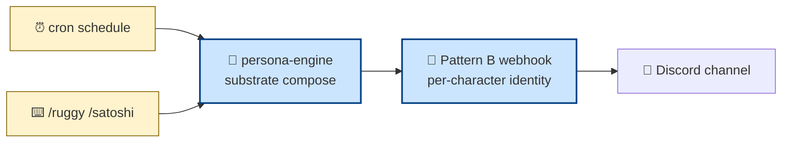

# freeside-characters

Multi-character Discord bot for the Honey Jar ecosystem. **Substrate** at
`packages/persona-engine/` (system-agent layer — cron, MCPs, delivery,
prompt composition). **Characters** at `apps/character-<id>/`
(participation-agent layer — markdown + JSON profiles). **Bot runtime**
at `apps/bot/` (thin loader that wires both into Discord).

Currently shipping **ruggy** (festival NPC narrator, lowercase OG voice)
and **satoshi** (mibera-codex agent, sentence-case cypherpunk register).
Slash commands `/ruggy` and `/satoshi` invite either character into
Discord conversations. Weekly cron also fires digests in voice per zone.

## Architecture at a glance

The substrate handles plumbing. Characters supply voice through markdown
profiles. The boundary is the `CharacterConfig` type contract — characters
never import substrate internals.



Two delivery paths share the substrate:

- **Write side (V0.6)** — cron fires per zone (weekly digest, pop-in, weaver). Pattern B identity via per-channel webhook.
- **Read side (V0.7-A.0)** — slash command → interactions HTTP endpoint → chat-mode reply with the user's prompt quote-prepended.

## One shell, many speakers (codified · cycle 001 phase 4)

The substrate (`packages/persona-engine/`) is shared. Characters (`apps/character-<id>/`) supply only voice + lore + register-locks. Characters share boot-time, prompt-composition, anti-spam, ledger, MCP wiring, Discord interaction handling. They diverge ONLY at the markdown/JSON profile layer.

### The umbrella rule

A new character earns its place inside this repo when:
- it's a Discord-side persona consuming the same delivery substrate (interactions HTTP, Pattern B webhook identity, anti-spam invariant)
- its voice + lore can be authored as `apps/character-<id>/{persona/, lore/, registers/}` markdown + JSON
- its runtime needs (LLM provider, prompt composition, Discord behaviors) DON'T diverge from the substrate's contract

Adding a character is then: a new `apps/character-<id>/` directory + a CHARACTERS env var entry. No new repo needed. See [`docs/CHARACTER-AUTHORING.md`](docs/CHARACTER-AUTHORING.md).

### When a character would split out (rare exit conditions)

A character earns its own repo (`construct-<character>` or `freeside-<character>`-shaped) ONLY if:
- its **runtime needs diverge** from the substrate (non-Discord delivery surface · custom LLM ensemble that doesn't fit the umbrella's provider abstraction · real-time voice/audio path)
- its **lifecycle drifts** from the umbrella's cadence (independent versioning · separate auth model · divergent deployment topology)
- the umbrella **starts working against it** rather than for it (per Eileen's civic-layer doctrine — see [`docs/CIVIC-LAYER.md`](docs/CIVIC-LAYER.md))

Until those conditions fire, characters stay inside this repo. The umbrella is the default; the split is the exception.

### Status (2026-05-02)

Today: ruggy + satoshi share the umbrella. Both consume the same persona-engine. Both use Pattern B webhook identity. Both honor the anti-spam invariant. Adding a third character (e.g., a future Honey Road NPC) follows the umbrella rule — no split warranted.

Codified during ecosystem-health cycle 001 (TEND mode · phase 4 clarification gap ③).

## Slash command flow

```mermaid
flowchart LR
  user["👤 /satoshi prompt:hi"] --> discord1["Discord"]
  discord1 --> ep["📡 /webhooks/discord<br/>Bun.serve · Ed25519 verify"]
  ep --> dispatch["🎯 dispatch<br/>anti-spam guard · resolve character"]
  dispatch --> ack["⚡ defer ACK<br/>(under 3s)"]
  ack --> compose2["🧪 composeReply<br/>persona + ledger + Anthropic SDK"]
  compose2 --> webhook["📨 channel webhook<br/>quote-prepend + Pattern B identity"]
  webhook --> discord2["💬 Satoshi message lands in channel"]

  classDef sub fill:#cce5ff,stroke:#004085,stroke-width:2px
  classDef io fill:#fff3cd,stroke:#856404
  class dispatch,compose2 sub
  class ep,webhook io
```



The anti-spam invariant: characters respond only to explicit user
invocations. Bot-author messages skip. Webhook-author messages skip.
Channel presence alone never triggers a reply. This rule survives every
phase.

## Run it locally

```bash
bun install
cp .env.example .env

# Stub mode — no external deps, verify the pipeline end-to-end
LLM_PROVIDER=stub bun run digest:once

# Real mode — digest cron + slash interactions
ANTHROPIC_API_KEY=sk-...     # or LLM_PROVIDER=bedrock when wired
DISCORD_BOT_TOKEN=...        # for Discord Gateway + webhook permissions
DISCORD_PUBLIC_KEY=...       # for Ed25519 signature verification
CHARACTERS=ruggy,satoshi
bun run --cwd apps/bot start
```

Slash command setup (Discord developer portal + ngrok / Railway domain):
[`docs/DISCORD-INTERACTIONS-SETUP.md`](docs/DISCORD-INTERACTIONS-SETUP.md).

## Where to read more

| Doc | What |
|---|---|
| [`docs/AGENTS.md`](docs/AGENTS.md) | **Start here** — landing page for agents working in this repo · ordered traversal of the rest |
| [`docs/ARCHITECTURE.md`](docs/ARCHITECTURE.md) | Substrate + character + delivery, full architectural picture |
| [`docs/CIVIC-LAYER.md`](docs/CIVIC-LAYER.md) | Why substrate ≠ character (Eileen's civic-layer doctrine) |
| [`docs/CHARACTER-AUTHORING.md`](docs/CHARACTER-AUTHORING.md) | Adding a new character to the umbrella |
| [`docs/MULTI-REGISTER.md`](docs/MULTI-REGISTER.md) | Per-character voice register locks |
| [`docs/DISCORD-INTERACTIONS-SETUP.md`](docs/DISCORD-INTERACTIONS-SETUP.md) | Slash command setup walkthrough |
| [`docs/DEPLOY.md`](docs/DEPLOY.md) | Railway / ECS deploy paths |
| [`CLAUDE.md`](CLAUDE.md) | Repo conventions for agents working in this codebase |

## Status (2026-04-30)

- 🟢 **V0.7-A.0 shipped** — slash commands `/ruggy` and `/satoshi` · Pattern B identity for chat replies · in-process per-channel ledger · quote-prepend for channel context
- 🟢 ruggy + satoshi live in THJ Discord; Ruggy#1157 shell account dispatches both
- 🟢 Anthropic Opus 4.7 driving digest and chat-mode pipelines
- 🟡 **V0.7-A.1 next** — gateway intents + messageCreate observe-only (immediately follows A.0 per cadence note)
- 🟡 Bedrock provider in design — Eileen's local-satoshi setup

License: AGPL-3.0
