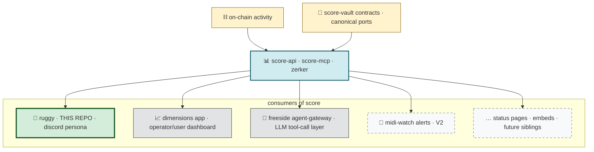
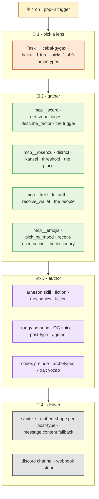

# freeside-characters (née freeside-ruggy)

> participation-agent umbrella for the honey jar ecosystem. **substrate** at `packages/persona-engine/` (system-agent layer — cron · delivery · MCP orchestration · score-mcp client). **characters** at `apps/character-<id>/` (participation-agent layer — markdown + JSON profiles). **bot** at `apps/bot/` (thin runtime that loads characters and dispatches through the substrate).
>
> V0.6-A pulled the layers apart structurally per [Eileen's civic-layer doctrine](docs/CIVIC-LAYER.md): system agents (governors) and participation agents (speakers) must not blur. Boundary enforced via package imports + the `CharacterConfig` type contract. New characters land as folders, not forks.
>
> *Ruggy is the first character — honey jar's bear, laid-back, groovy, been here since the og chat days. Satoshi (Mibera ancestor, codex grail #4488 = Hermes) joins in V0.6-C.*

```
ʕ •ᴥ•ʔ  stay groovy 🐻
```

**See:** [`docs/CIVIC-LAYER.md`](docs/CIVIC-LAYER.md) · [`docs/CHARACTER-AUTHORING.md`](docs/CHARACTER-AUTHORING.md) · [`docs/MULTI-REGISTER.md`](docs/MULTI-REGISTER.md) · [`apps/character-ruggy/ledger.md`](apps/character-ruggy/ledger.md)

---

## what this is

ruggy is a **character**, not a bot. been around since 2023 — `0xHoneyJar/ruggy-bot/index.js:92` is the og system prompt. this repo is one surface of him: the activity-reporting one, running on discord. as of V0.6-A, the runtime that carries his voice is shared substrate; future characters (satoshi · …) plug into the same engine.

```
   signal  ──▶  lens stack  ──▶  surface
  score-mcp     rosenzu · arneson    discord (today)
                cabal · codex        webhook · email · ops · …
                emojis · auth        (any chat-shaped target)
```

**the architecture isn't bot-specific.** persona doc, codex prelude, rosenzu spatial profile, cabal lens rotation, emoji catalog — all portable. only `apps/bot/src/discord/` is discord-shaped. swap surfaces, keep the stack. swap the character, swap the world — the composition pattern stays.

this is the extractable thing: a reference implementation for sibling personas — different character, different world, different chat. forks welcome.

---

## two-layer bot model

ruggy is the **persona layer**. different layer from the freeside ops bot.

| layer | bot | role | cadence | blast radius |
|---|---|---|---|---|
| 🟦 base utility | [sietch](https://github.com/0xHoneyJar/loa-freeside) (jani-managed) | `/verify` `/onboard` `/score` `/agent` `/buy-credits` — must-haves. one per guild. | reactive (slash commands) | wide (auth, payments) |
| 🟧 persona | **ruggy (this repo)** + future siblings | channel posts, proactive digests, npc voice. want-to-haves. zero-or-many per guild. | proactive (cron + pop-ins) | narrow (one channel set) |

no command overlap. different ownership. different deploy units. sietch is infra; ruggy is a character. ref: [two-layer-bot-model](https://github.com/0xHoneyJar/loa-freeside/issues/191).

the persona-layer slot is the extractable one — zero, one, or many per guild, each their own character + world-tie + posting register.

---

## topology

score is the **bookkeeping layer**. many consumers read it; ruggy is one — the one that translates signals into a character's voice in a chat surface. the rest of this repo is how that translation happens.



---

## how a post gets composed

cron fires (or a pop-in roll lands). ruggy runs this loop:



**constructs aren't libraries — they're packaged expertise.** rosenzu carries lynch's spatial vocabulary. arneson carries ttrpg-dm scene-gen rules. gygax carries phantom-player archetypes. the codex carries lore + trait vocabulary. the emoji registry carries thj's expressive surface. the agent loop pulls from each before token-1.

---

## the constructs

each construct is **a single discipline as a callable surface**. voice quality is a function of how much grounded context lands before token-1.

| construct | lens | surface | carries |
|---|---|---|---|
| 🗺️ **rosenzu** | place | in-bot mcp | lynch primitives (node/district/edge/path/inner_sanctum) · kansei vectors (warmth/motion/shadow/density/feel) · per-fire variance · threshold transitions |
| 🎭 **arneson** | scene-gen | claude code skill | fiction·mechanics·fiction primitive · sensory layering (~30% env / 70% action) · in-character error register · anti-westworld variance |
| 🎲 **cabal-gygax** | rotation | sdk subagent (haiku) | 9 phantom-player archetypes (optimizer · newcomer · storyteller · rules-lawyer · chaos-agent · gm · anxious-player · veteran · explorer) · solves lens monotony |
| 📚 **codex** | lore | text prelude | mibera codex `llms.txt` ~2k tokens · archetypes · traits · drug-tarot · ancestor lineages · factor vocab · always-on, not on-demand |
| 😎 **emojis** | expressive | in-bot mcp | 43-emoji thj guild catalog (26 mibera + 17 ruggy) · mood-tagged · random pick + cross-process recent-used cache (`emoji-recent.jsonl`) |
| 🪪 **freeside_auth** | identity | in-bot mcp | wallet → handle/discord/mibera_id against `midi_profiles` (railway pg) · 5-min lru · lets prose say `@nomadbera` not `0xb307…d8` |
| 📊 **score** | bookkeeping | remote mcp (zerker) | `get_zone_digest` · `describe_factor` · `list_dimensions` · `describe_dimension` · the trigger |

ref: `vault/wiki/concepts/construct-ontology.md` for why "construct" not "skill".

---

## character not chatbot

ruggy is a **character**, not an assistant. voice is sealed by the persona doc — the doc is the constitution; the llm is the actor reading the lines.

| | chatbot | ruggy |
|---|---|---|
| voice source | llm defaults (helpful-assistant) | persona doc + ICE exemplars |
| greeting | "Hello! How can I help?" | "yo stonehenge" · "henlo bear-cave" |
| numbers | llm-generated (hallucination risk) | score-mcp (deterministic, fact-checked) |
| errors | "I apologize for the inconvenience" | "cables got crossed on the main rig" |
| lowercase | inconsistent | invariant — caps only for proper nouns + tickers |
| lore | none or rag-on-demand | codex always loaded |
| post shape | one template | 6 types · own fragment + cadence each |
| lens | fixed | rotated per fire (9 archetypes) |
| place | none | lynch primitive + kansei vector per zone |

**fact-checked numbers + sealed voice + rotated lens + grounded place + lore awareness = a character that posts, not a bot that reports.**

---

## six post types · three cadences

| type | shape | when |
|---|---|---|
| 📰 **digest** | weekly backbone · structured (greeting · stat · prose · closing) | sunday utc midnight, one per zone |
| 💭 **micro** | pop-in · 1-3 sentences · no greeting · casual surface | per-zone die-roll on `POP_IN_PROBABILITY` |
| 🪡 **weaver** | cross-zone · names a connection across 2+ zones | wednesday noon utc, primary zone |
| 📚 **lore_drop** | codex-anchored · archetype / drug-tarot / element ref | pop-in roll |
| ❓ **question** | open-ended invitation, anchored in data | pop-in roll |
| 🚨 **callout** | anomaly alert · calm voice over alarm-shaped data | trigger-driven |

same og voice across all six. each type has its own persona fragment (loaded selectively) + data-fit guard (`postTypeFitsData()`) so micros don't pop in to flat data and callouts don't fire without an anomaly.

**arcade move: surprise > schedule.** mix shapes so channels feel alive.

---

## four festival zones

zerker's `score-mcp` flavor maps four dimensions of mibera activity onto a festival metaphor:

| zone | lynch primitive | score dimension | archetype |
|---|---|---|---|
| 🗿 **stonehenge** | node | overall | monolithic observatory hub · cross-zone |
| 🐻 **bear-cave** | district | og | freetekno lineage · low-lit warehouse |
| ⛏️ **el-dorado** | edge | nft | milady-aspirational · treasure-hunt |
| 🧪 **owsley-lab** | inner_sanctum | onchain | acidhouse · owsley stanley · late-night precision |

each zone: a lynch primitive (kind of place), an archetype tie-in (codex), a baseline kansei vector that rosenzu rotates per fire. per-zone channel mapping in `.env`.

`the-warehouse` exists vocabulary-only — accessible to rosenzu for cross-zone weaver references; activation deferred.

---

## quick start

```bash
bun install
cp .env.example .env

# stub mode — no external deps, end-to-end
LLM_PROVIDER=stub bun run digest:once

# anthropic-direct — LLM testing
LLM_PROVIDER=anthropic ANTHROPIC_API_KEY=sk-… bun run digest:once
```

`STUB_MODE=true` (default) generates synthetic ZoneDigests by day-of-week (normal/quiet/spike/thin). `LLM_PROVIDER` is explicit — `stub` · `anthropic` · `freeside` · `auto`. full deploy → [`docs/DEPLOY.md`](docs/DEPLOY.md).

---

<details>
<summary>📁 repository layout</summary>

```
apps/bot/
  src/
    index.ts                  · entry · wires cron + delivery
    config.ts                 · zod-validated env (LLM_PROVIDER, cadences, channels)
    cli/digest-once.ts        · one-shot CLI for testing
    cron/scheduler.ts         · three concurrent cadences with per-zone fire lock
    score/
      client.ts               · score-mcp client + stub generator
      types.ts                · ZoneDigest / RawStats / NarrativeShape
      codex-context.ts        · mibera codex prelude loader
    persona/
      ruggy.md                · canonical persona (the constitution)
      loader.ts               · per-post-type fragment extractor
      exemplar-loader.ts      · ICE (in-context exemplars) loader
      exemplars/              · past ruggy posts grouped by post type
      creative-direction.md   · FEEL-side direction notes
    agent/
      orchestrator.ts         · claude agent sdk query() runtime
      rosenzu/                · in-bot sdk mcp (place lens)
      cabal/gygax.ts          · subagent (lens rotation)
      emojis/                 · in-bot sdk mcp (expressive surface)
      freeside_auth/          · in-bot sdk mcp (identity overlay)
    llm/
      composer.ts             · build prompt pair → invoke
      agent-gateway.ts        · explicit provider routing
      post-types.ts           · 6 post types + data-fit guards
    discord/
      client.ts               · discord.js gateway client (with reconnect)
      post.ts                 · per-zone delivery routing
    format/
      embed.ts                · embed shape per post type
      sanitize.ts             · discord markdown escape
  .claude/
    skills/arneson/SKILL.md   · scene-gen skill (loaded via settingSources)

packages/
  protocol/                   · sealed-schema sub-package (V1 empty —
                                ruggy is a consumer of score-vault)

docs/
  ARCHITECTURE.md             · deeper architecture walk
  DEPLOY.md                   · ECS + railway deploy paths
```

</details>

---

## status · 2026-04-29

- 🟢 **V0.5-E shipped** — gygax cabal lens rotation · factor mcp retired (routes to score-mcp v1.1) · phrase variance · emoji-recent variance cache
- 🟢 **ruggy#1157 live** in 4 thj discord channels · full tooling stack
- 🟢 **5 in-bot mcps** — rosenzu · freeside_auth · emojis · cabal-gygax (subagent) · score (HTTP)
- 🟢 **43-emoji catalog** — real discord names · animated flags · cross-process recent-used cache
- 🟢 **persona doctrine** — og ruggy-bot anchor restored · mibera/MiDi vocab · post-type fragments · ICE-ready
- 🟡 **voice tightening in flight** — recent-posts cache · vocab leakage · lens-monotony · cadence rhythm → [seed](https://github.com/0xHoneyJar/bonfire/blob/main/grimoires/bonfire/context/ruggy-creative-direction-seed-2026-04-29.md)

infra is shipped. what remains is creative direction tightening — voice, vocab, variance, cadence rhythm — fresh kickoff sessions, not more scaffold.

---

## cult · tech · community

the point isn't a better bot. it's making activity **felt** in the channel where the community lives.

honey jar has been community-first since 2023. score quantifies what mibera do; the dimensions app shows it on a dashboard for those who go look. but most of the community lives in discord, in the channels, where attention already is.

**a persona-layer bot brings activity TO the channel** — not as alerts, not as reports, but as a character noticing things in the voice the community already speaks.

not bloomberg terminal in discord skin. a bear who's been here since the og chat days, who happens to watch the data.

the extractable thing isn't ruggy specifically. it's the **pattern**:

```
   score-as-trigger  ·  construct-stack-as-lens  ·
   persona-as-voice  ·  chat-channel-as-surface
```

applied to any community with their own bookkeeping layer, their own world, their own character. fork welcome.

---

## refs

| | |
|---|---|
| 📐 two-layer bot model | [loa-freeside#191](https://github.com/0xHoneyJar/loa-freeside/issues/191) |
| 🐻 persona (this repo) | `apps/bot/src/persona/ruggy.md` |
| 📜 canonical persona | `~/bonfire/grimoires/bonfire/context/ruggy-canonical-persona-2026-04-28.md` |
| 🎨 creative direction seed | `~/bonfire/grimoires/bonfire/context/ruggy-creative-direction-seed-2026-04-29.md` |
| 🚀 V0.5-E kickoff seed | `~/bonfire/grimoires/bonfire/context/ruggy-v05-kickoff-seed-2026-04-28.md` |
| 🏷️ naming conventions | `vault/wiki/concepts/loa-org-naming-conventions.md` |
| 🧬 construct ontology | `vault/wiki/concepts/construct-ontology.md` |

---

AGPL-3.0 · matching loa-freeside.
