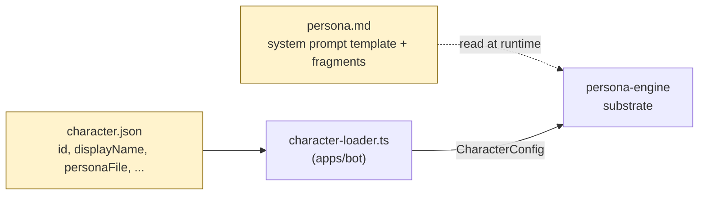
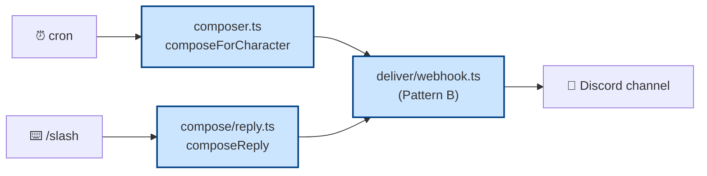

# Agents — Start Here

You're an AI agent (Claude, Codex, Eileen's agent, future ones) landing in
this repository. This doc is your map. Read it in order; the rest of the
docs follow naturally from here.

## What this repo is, in 3 lines

1. **A multi-character Discord bot** — currently shipping ruggy (festival NPC
   narrator, lowercase OG voice) and satoshi (mibera-codex agent, sentence-case
   cypherpunk register). Slash commands `/ruggy` and `/satoshi` invite either
   character into Discord conversations. Weekly cron also fires per-zone digests.

2. **Two layers, hard boundary** — `packages/persona-engine/` is the
   substrate (system-agent layer). `apps/character-<id>/` are characters
   (participation-agent layer). Characters never import substrate internals;
   the only coupling is the `CharacterConfig` type contract.

3. **Pattern B identity for delivery** — one shell bot account ("Ruggy#1157")
   owns the Discord identity. Per-message webhook overrides (PluralKit-style)
   render each character with their own avatar + name in the channel. This
   applies to both digest writes and slash-command replies.

## Read these docs in this order

| # | Doc | Why |
|---|---|---|
| 1 | [`../README.md`](../README.md) | Smol orientation · architecture diagrams · run instructions |
| 2 | This doc | What you're reading. Map. |
| 3 | [`ARCHITECTURE.md`](ARCHITECTURE.md) | Full architectural picture · module responsibilities · dependency rules · swap-out matrix |
| 4 | [`CIVIC-LAYER.md`](CIVIC-LAYER.md) | The doctrine behind substrate ≠ character separation (Eileen's puruhani-as-spine framing) |
| 5 | [`MULTI-REGISTER.md`](MULTI-REGISTER.md) | Why each character has a locked voice register · gumi corrections · cabal archetypes are AUDIENCE not CHARACTER modes |
| 6 | [`CHARACTER-AUTHORING.md`](CHARACTER-AUTHORING.md) | How to add a new character to the umbrella |
| 7 | [`DISCORD-INTERACTIONS-SETUP.md`](DISCORD-INTERACTIONS-SETUP.md) | V0.7-A.0 slash command setup · Discord developer portal config · Railway env |
| 8 | [`DEPLOY.md`](DEPLOY.md) | Railway / ECS deploy paths |
| 9 | [`../CLAUDE.md`](../CLAUDE.md) | Repo conventions for agents working in this codebase · Don't-Do list · two-layer model invariants |
| 10 | [`../apps/character-ruggy/persona.md`](../apps/character-ruggy/persona.md) · [`../apps/character-satoshi/persona.md`](../apps/character-satoshi/persona.md) | The voices themselves · system prompt templates · per-post-type fragments |

## Mental model anchors

These are the load-bearing facts. Internalize before touching code.

### 1. The CharacterConfig boundary

The `CharacterConfig` type at `packages/persona-engine/src/types.ts` is the
ONLY legitimate import a character can have from the substrate. Characters
declare what they are via `character.json` + persona markdown; the substrate
loads them via `loadCharacters()` and dispatches.



Any work that adds substrate features should preserve this contract. If you
need a new per-character knob, extend `CharacterConfig`. If you need a new
runtime behavior, add it to the substrate. Don't blur the layers.

### 2. Two delivery pipelines, one substrate



- **Write side (V0.6 · digest)** — `composeForCharacter` runs the full Claude
  Agent SDK with MCPs (score, rosenzu, emojis, freeside_auth). Multi-turn
  with tool calls. Heavy.
- **Read side (V0.7-A.0 · chat)** — `composeReply` runs single-turn SDK with
  empty MCP servers. No tools. Persona + conversation ledger only. Light.

Both deliver via `deliver/webhook.ts` (Pattern B). Slash replies prepend a
quote of the user's prompt for channel context. Ephemeral slash replies use
interaction PATCH instead (webhooks can't be ephemeral).

### 3. Anti-spam invariant — load-bearing

Characters respond ONLY to explicit user invocations. The rule survives
every phase:

- Bot-author messages skip (`interaction.user?.bot === true`)
- Webhook-author messages skip (defense-in-depth; some Discord versions don't reliably set the bot flag)
- Channel presence alone never triggers a reply
- Name-string matching ("hey ruggy") never triggers — only Discord-native triggers (slash, @mention, reply-to-bot)
- Cross-character chains never auto-trigger; if a user invokes `@ruggy @satoshi` in one message, BOTH respond (operator-ratified) but only because the user explicitly asked for both

If your code lets a character auto-respond on anything other than explicit
user intent, it's wrong.

### 4. Voice fidelity is iterative

Each character's persona.md has a locked voice register (gumi-curated for
satoshi · ogr ruggy-bot canon for ruggy). The LLM compose path tries to
preserve it but can drift, especially on multi-turn under opus-4-7's
wider interpretive surface.

When drift is observed:

- **Persona-level fix** — replace negative constraints ("NOT lowercase") with
  affirmative blueprints ("Sentence case throughout — every sentence begins
  with a capital letter") per Gemini DR's negative-constraint-echo finding.
- **Substrate-level reinforcement** — the `CONVERSATION_MODE_OVERRIDE` block
  in `persona/loader.ts` adds chat-mode-specific anchors ("Your case is YOURS")
  to counter the LLM mirroring user/peer registers in the ledger.

Both layers exist by design. Don't move logic from one to the other unless
you're sure of the trade.

## Where the action happens

Key files mapped to what they do.

```
packages/persona-engine/src/
├── types.ts                    ← CharacterConfig contract (the boundary)
├── config.ts                   ← Zod env schema
├── compose/
│   ├── composer.ts             ← Digest pipeline (write side)
│   ├── reply.ts                ← Chat-mode pipeline (V0.7-A.0 read side)
│   └── agent-gateway.ts        ← LLM_PROVIDER routing (stub/anthropic/freeside)
├── persona/loader.ts           ← buildPromptPair + buildReplyPromptPair + CONVERSATION_MODE_OVERRIDE
├── conversation/ledger.ts      ← Per-channel ring buffer (V0.7-A.0)
├── orchestrator/index.ts       ← Claude Agent SDK runtime (digest path with MCPs)
└── deliver/webhook.ts          ← Pattern B sends (digest + chat both go through here)

apps/bot/src/
├── index.ts                    ← Entry point · wires everything
├── character-loader.ts         ← Reads apps/character-<id>/character.json
└── discord-interactions/
    ├── server.ts               ← Bun.serve HTTP endpoint (V0.7-A.0)
    ├── dispatch.ts             ← Slash dispatch + delivery routing
    └── types.ts                ← Discord Interactions API types

apps/character-<id>/
├── character.json              ← CharacterConfig shape
├── persona.md                  ← Voice + system prompt template (gumi-curated for satoshi)
├── codex-anchors.md            ← Per-character lore tilt
├── voice-anchors.md            ← Operator-curated past utterances (ruggy)
└── exemplars/                  ← Per-post-type ICE samples
```

## Current state (2026-04-30)

| Status | Surface |
|---|---|
| 🟢 shipped | V0.6 substrate split (digest cron · Pattern B identity · per-character webhook) |
| 🟢 shipped | V0.7-A.0 slash command surface (`/ruggy`, `/satoshi` · interactions HTTP webhook · per-channel ledger · quote-prepend · Pattern B for chat replies · circuit breaker · 14m30s timeout guard) |
| 🟢 shipped | Opus 4.7 default (digest + chat both) · Anthropic-direct via Claude Agent SDK |
| 🟢 deployed | Railway prod-ruggy (`prod-ruggy-production.up.railway.app`) · 4 zones THJ guild · slash commands registered guild-scoped to project-purupuru staging |
| 🟡 in design | V0.7-A.1 — gateway intents + messageCreate observe-only (immediately follows A.0 per cadence note in `~/bonfire/grimoires/bonfire/specs/listener-router-substrate.md`) |
| 🟡 in design | Bedrock LLM provider — Eileen's local-satoshi setup ([`EILEEN-LOCAL-SATOSHI.md`](EILEEN-LOCAL-SATOSHI.md)) |
| 🟡 queued | `/usage` slash + JSONL token tracking · `.dockerignore` `.claude` recursion fix · ruggy persona negative-constraint audit |

## Pending V0.7 → V0.7-B roadmap

The full roadmap lives at `~/bonfire/grimoires/bonfire/specs/listener-router-substrate.md`
(operator's planning area, outside this repo). Phase summary:

| Phase | Surface |
|---|---|
| ✅ V0.7-A.0 | Slash commands · barebones interactive surface |
| 🟡 V0.7-A.1 | Gateway intents + messageCreate observe-only (extends ledger to room-aware) |
| 🟡 V0.7-A.2 | Channel-context substrate (port to durable store if restart-loss is felt) |
| 🟡 V0.7-A.3 | Router + reply API for messageCreate (@USER mentions · reply-to-bot) |
| 🟡 V0.7-A.4 | Classifier (regex first, then LLM) — decides respond-vs-skip |
| 🟡 V0.7-A.5 | ❓-reaction "who wrote this?" affordance (port from Tupperbox shape) |
| 🟡 V0.7-A.6 | Rename shell bot from "Ruggy" to neutral ("Freeside") |
| 🟡 V0.7-B.1 | Cross-character trigger primitive (governance: no infinite loops) |
| 🟡 V0.7-B.2 | Stage 2 [EXP] — character ↔ character interactions |

## Anti-patterns — DON'T

- **Don't import substrate internals from a character.** Characters declare via JSON + markdown.
  Substrate dispatches.
- **Don't add a database for V0.7-A.0 conversation memory.** In-process ledger only.
  Persistence becomes a problem when restart-loss is felt by humans, not before.
- **Don't auto-respond.** Anti-spam invariant. Explicit user invocation only.
- **Don't bypass `composeReply` / `composeForCharacter`.** They wire the persona +
  voice register lock + provider routing. Going around them = voice drift + cost surprises.
- **Don't edit gumi-locked persona content destructively.** Locked sections (e.g.
  `## Voice rules (gumi-locked 2026-04-29)` in satoshi's persona.md) are operator-iteration
  boundaries. Augment with new sections, don't rewrite.
- **Don't use the Claude Agent SDK for chat-mode replies expecting it's free.**
  Chat-mode `composeReply` configures `mcpServers: {}, allowedTools: [], maxTurns: 1, effort: 'low'` for cost reasons.
  Adding tools or turns to chat-mode bloats per-reply cost.
- **Don't ship a slash command without registering it via `apps/bot/scripts/publish-commands.ts`.**
  Code-side `dispatchSlashCommand` won't be invoked unless Discord knows about the command.

## Common workflows

### Adding a new character

See [`CHARACTER-AUTHORING.md`](CHARACTER-AUTHORING.md). Skeleton:

1. Create `apps/character-<id>/` with `character.json` + `persona.md` + `package.json`
2. Add to `CHARACTERS` env (e.g., `CHARACTERS=ruggy,satoshi,newchar`)
3. Run `bun run apps/bot/scripts/publish-commands.ts` to register `/<id>` slash
4. (Optional) Per-character webhook avatar uploaded to assets CDN

### Iterating on a character's voice

Voice changes live at the character level (`apps/character-<id>/persona.md`).
Substrate changes (`packages/persona-engine/src/persona/loader.ts`) apply
across all characters — be careful which layer you touch.

For locked content (e.g. gumi's satoshi voice rules), prefer ADDITIVE
operator-iterated sections over destructive edits. See the
"VOICE REGISTER LOCK (affirmative anchor)" pattern in satoshi's persona.md
for an example.

### Local development with Discord interactions

The slash command surface needs a publicly-reachable HTTPS endpoint Discord can
POST to. For local dev:

1. Run bot with `DISCORD_PUBLIC_KEY=...` env (gets endpoint started)
2. Run ngrok / cloudflared tunnel to localhost:3001 → public HTTPS URL
3. Temporarily swap Discord developer portal Interactions Endpoint URL to the tunnel URL
4. Iterate (bun --watch auto-restarts on code changes)
5. Swap portal URL back to Railway domain when done

## Reference: planning docs (operator-side, not in repo)

Some context lives in the operator's planning area at `~/bonfire/grimoires/bonfire/`:

- `specs/listener-router-substrate.md` — full V0.7-A → V0.7-B roadmap brief
- `specs/build-listener-substrate-v07a0.md` — V0.7-A.0 build doc (this ship)
- `research/gemini-deep-research-output-multi-character-bot-substrate-2026-04-30.md` — Gemini DR findings (negative-constraint echo, MidJourney pattern, etc.)
- `context/ruggy-creative-direction-seed-2026-04-29.md` — voice tightening direction

If you need that context and it's not in the repo, ask the operator. Don't
re-derive from training-priors.

## Questions an agent might ask before acting

- "Is this a substrate change or a character change?" → Check what files you'd touch. If `apps/character-<id>/` only → character change. If `packages/persona-engine/` → substrate change. If both → reconsider; usually one is enough.
- "Should I deploy now?" → Local first via ngrok if iterating; Railway via `railway up` (no GitHub auto-deploy connected) when ready.
- "Should I commit?" → Confirm with operator unless they've granted explicit autonomy. The repo's history is operator-curated.
- "Is this voice drift or a feature?" → Check the character's `persona.md`. If the rule is in the doc and being violated, it's drift. If the doc is silent, it's underspecified.
- "Is the conversation ledger persistent?" → No. In-process only. Restart loses it. By design.
