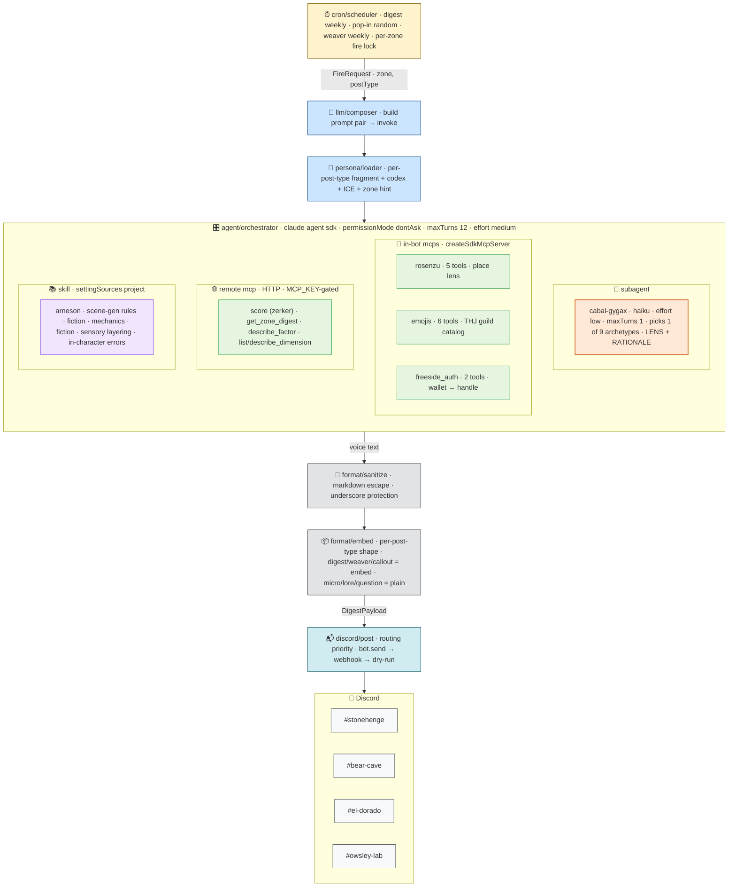
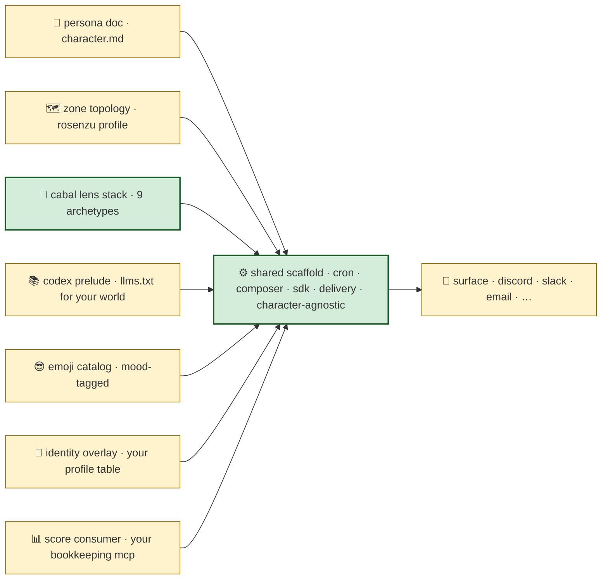

# architecture

V0.5-E. single bot process. three concurrent cadences. tripartite construct stack: trigger (score-mcp) + place (rosenzu) + scene-gen (arneson) + rotation (cabal-gygax) + identity (freeside_auth) + expressive (emojis). LLM runtime is the claude agent sdk; subagents and in-bot mcps are sdk primitives.

> earlier "V1 webhook + polling" framing has been superseded. git history (`b3bf205` → present) carries the V0.2 → V0.5-E evolution.

## Module responsibilities

| Module | Responsibility | External deps |
|---|---|---|
| `cron/scheduler.ts` | Three concurrent cadences (digest backbone, pop-in random, weaver weekly) with per-zone fire lock | `node-cron` |
| `score/client.ts` | Real MCP client over JSON-RPC + SSE (initialize → notifications/initialized → tools/call) OR synthetic ZoneDigest in stub mode | `fetch` |
| `score/types.ts` | Mirror score-vault contracts (ZoneDigest / RawStats / NarrativeShape) until `@score-vault/ports` ships | — |
| `score/codex-context.ts` | Load Mibera Codex `llms.txt` from bundled or operator-local path | — |
| `persona/ruggy.md` | Canonical persona — single source of truth for voice + Discord-as-Material rules + per-post-type fragments | — |
| `persona/loader.ts` | Extract per-post-type fragment + substitute placeholders | — |
| `persona/exemplar-loader.ts` | Load ICE (in-context exemplars) by post type, random select up to 5 per call | — |
| `agent/orchestrator.ts` | Claude Agent SDK query() runtime; wires mcpServers, subagents, allowedTools, permissionMode | `@anthropic-ai/claude-agent-sdk` |
| `agent/rosenzu/` | In-bot SDK MCP — place lens (Lynch primitives, KANSEI vectors, threshold transitions) | `@anthropic-ai/claude-agent-sdk` |
| `agent/cabal/gygax.ts` | Subagent (haiku, maxTurns:1) — picks 1 of 9 phantom-player archetypes; main thread shifts register | `@anthropic-ai/claude-agent-sdk` |
| `agent/emojis/` | In-bot SDK MCP — 43-emoji THJ catalog with mood tags + cross-process recent-used cache (`.run/emoji-recent.jsonl`) | `@anthropic-ai/claude-agent-sdk` |
| `agent/freeside_auth/` | In-bot SDK MCP — wallet → handle/discord/mibera_id resolution against `midi_profiles` (Railway Postgres) with 5-min LRU | `@anthropic-ai/claude-agent-sdk`, `pg` |
| `llm/composer.ts` | Build prompt pair → fetch digest in parallel → invoke LLM → build payload | composes others |
| `llm/agent-gateway.ts` | Explicit provider routing (`stub` / `anthropic` / `freeside` / `auto`) | — |
| `llm/post-types.ts` | 6 post-type specs (digest/micro/weaver/lore_drop/question/callout) + data-fit guards (`postTypeFitsData`, `popInFits`, `calloutFits`) | — |
| `format/sanitize.ts` | Discord markdown escape (underscore protection, etc.) | — |
| `format/embed.ts` | Per-post-type shape (embed for structured, plain content for casual) | — |
| `discord/client.ts` | discord.js Gateway client with reconnect-on-disconnect | `discord.js` |
| `discord/post.ts` | Per-zone delivery routing (bot → webhook → dry-run) | — |
| `apps/bot/.claude/skills/arneson/SKILL.md` | Scene-gen skill — fiction·mechanics·fiction primitive, sensory layering, in-character errors | (loaded via `settingSources: ['project']`) |

## dependency rules

| module | knows | doesn't know |
|---|---|---|
| `score/*` | score-mcp protocol | discord, llm |
| `agent/*` | sdk runtime + each construct's discipline | delivery |
| `persona/*` | markdown → strings (pure) | data |
| `format/*` | data + voice → discord shape (pure) | transport |
| `discord/*` | discord transport | llm, score |
| `llm/composer.ts` | **all of them** — the ONE module that composes | — |

swap-out matrix:

| swap | rest unchanged |
|---|---|
| `discord/*` → email · status page · slack · terminal | voice + constructs |
| `score/*` → other bookkeeping layer | persona + constructs |
| persona doc → sibling character | construct stack |
| zones → different topology | rosenzu profile + cron pivot |
| add MCP | register in `buildMcpServers`, llm picks up via persona |

## stub modes — two orthogonal axes

- **`STUB_MODE=true`** (default) — synthetic ZoneDigest by day-of-week (normal/quiet/spike/thin). bypasses score-mcp.
- **`LLM_PROVIDER=stub`** — canned digest output, no llm call. bypasses anthropic sdk + freeside gateway.

independent. pure-offline = both on. voice-validation path: `STUB_MODE=true LLM_PROVIDER=anthropic ANTHROPIC_API_KEY=…`.

## why discord.js (gateway) now

V0.2 used webhooks. V0.5-A migrated to the gateway (`discord.js`) for:

- per-zone channel routing (4 channels, 1 bot user) — webhooks force 1-channel-per-url
- reconnect-on-disconnect lifecycle
- future bot mention parsing (V2)
- gateway-only intents (Guilds intent suffices today)

webhooks remain as fallback. slash commands are NOT here — they'd cross into sietch's surface (`loa-freeside/themes/sietch`).

## why no DB

state that persists across runs:

- **score-mcp** — activity history (zerker's domain)
- **midi_profiles** — wallet→identity (loa-freeside's domain)
- **`.run/*.jsonl`** — emoji recent-used cache (file-backed, cross-process)

ruggy is otherwise stateless. persona is markdown, schedule is cron, digest is fetched fresh per fire. nothing else needs to persist.

if V2+ adds per-guild config (cadence override, mute-until), digest history, error/retry state — small sqlite + drizzle is planned. not before. queued: `recent-posts.jsonl` cache parallel to emoji-recent (per V0.5-E creative direction seed) for content-variance pressure.

## future shape

| addition | trigger | module |
|---|---|---|
| `recent-posts.jsonl` cache + MCP | V0.5-E same-data restatement fix | new `agent/memory/` MCP |
| NATS subscriber | freeside ACTIVITY stream live | `score/nats-subscriber.ts` |
| slack · email · status-page surface | sibling persona on non-discord surface | new module peer to `discord/` |
| multi-guild config | another guild adopts ruggy | sqlite + drizzle |
| ANSI granular feed | high-frequency anomaly alerts | `format/ansi.ts` |
| schemas published by ruggy | sibling persona coordination | `packages/protocol/` (currently empty placeholder) |

## construct extractability

pattern is portable. to deploy a sibling persona:

🟨 = per-character variable. 🟩 = stays the same across siblings.

most of `apps/bot/src/` works as a template. `persona/`, the rosenzu profile, the codex pointer, and the surface module are the per-character variables. the rest carries.
