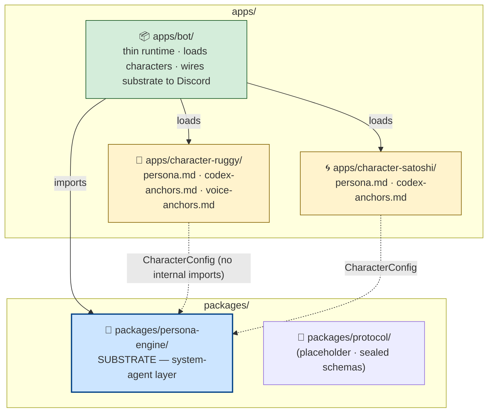
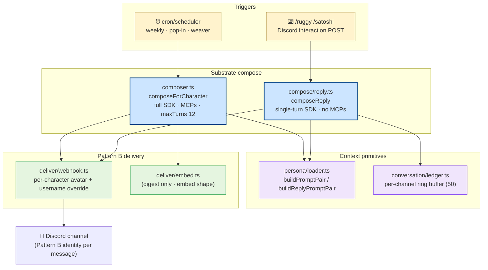
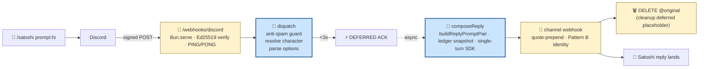
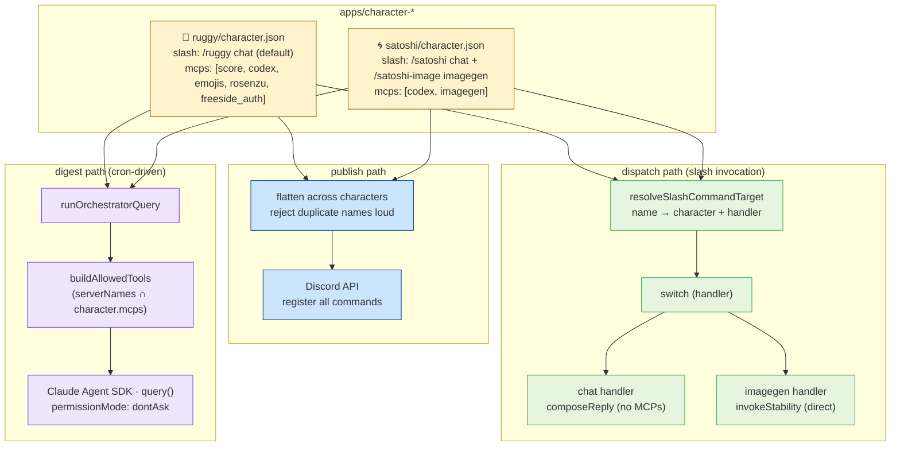
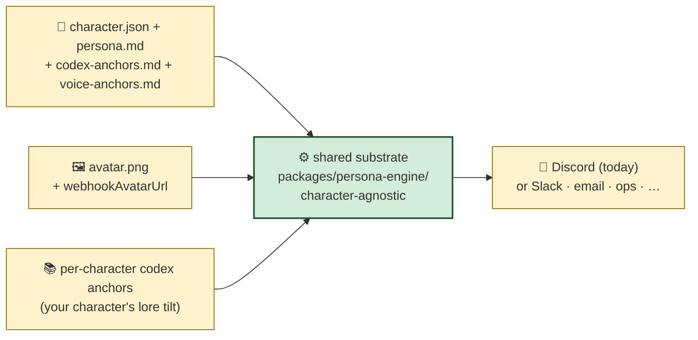

# Architecture

Multi-character Discord bot. V0.6 split substrate from characters. V0.7-A.0
added the read-side surface (slash commands → chat-mode replies) alongside
the existing write-side (cron-driven digest delivery). Single bot process,
two character profiles, two delivery paths sharing one substrate.

> Earlier "V1 webhook + polling" framing has been superseded. Git history
> (`b3bf205` → `46dda38` V0.6 substrate split → `60aaf51` V0.7-A.0 ship)
> carries the V0.2 → V0.7-A.0 evolution.

## Layers

The boundary is the `CharacterConfig` type contract (`packages/persona-engine/src/types.ts`). Characters
NEVER import substrate internals; they declare what they are via `character.json` + persona
markdown, and the substrate dispatches.

## Two pipelines, one substrate

Both write side (digest cron) and read side (slash commands) compose through
`packages/persona-engine/`. They differ in trigger source, prompt shape, and
delivery mechanics.

## Read side (V0.7-A.0)

Discord interaction webhook + chat-mode pipeline. Bot listens on
`INTERACTIONS_PORT` (default 3001 · falls back to `PORT` for Railway/Heroku).

Key design rules baked into V0.7-A.0:

- **Anti-spam invariant** — characters reply ONLY to explicit user invocations. Bot-author messages skip · webhook-author messages skip · channel presence alone never triggers.
- **Token-expiry guard** — composeReply wrapped in 14m30s `Promise.race` (Discord interaction tokens hard-expire at 15:00 with no refresh; PATCH after that returns 404 + freezes the UI).
- **Follow-up rate limit** — chunks beyond the first throttle at 1.5s gaps to stay under Discord's 5/2sec interaction follow-up ceiling.
- **Circuit breaker** — 3 consecutive 403s on a channel webhook → blacklist that channel ID in-memory until process restart. Prevents Cloudflare's 10K-invalid-req/10min global ban from cascading.
- **Ephemeral fallback** — `ephemeral:true` invocations use interaction PATCH (webhooks can't be ephemeral); non-ephemeral uses Pattern B webhook for character-identity rendering.
- **Quote-prepend** — non-ephemeral replies prepend a Discord blockquote of the user's prompt so other channel members see context (slash-command argument values aren't shown in Discord's invocation header).

## Module responsibilities

### `packages/persona-engine/src/` — substrate

| Module | Responsibility | External deps |
|---|---|---|
| `index.ts` | Public API barrel · what `apps/bot/` imports | — |
| `types.ts` | `CharacterConfig` (the contract), `ZoneId`, `PostType`, `EmojiAffinityKind` | — |
| `config.ts` | Zod-validated env (LLM_PROVIDER, cadences, channels, INTERACTIONS_PORT, DISCORD_PUBLIC_KEY) | `zod` |
| `cron/scheduler.ts` | Three concurrent cadences (digest backbone, pop-in random, weaver weekly) with per-zone fire lock | `node-cron` |
| `score/client.ts` | score-mcp client over JSON-RPC + SSE OR synthetic ZoneDigest in stub mode | `fetch` |
| `score/types.ts` | Mirror score-vault contracts (ZoneDigest / RawStats / NarrativeShape) | — |
| `score/codex-context.ts` | Mibera Codex `llms.txt` prelude loader | — |
| `persona/loader.ts` | `buildPromptPair` (digest) + `buildReplyPromptPair` (chat-mode · V0.7-A.0) · CONVERSATION_MODE_OVERRIDE · per-post-type fragment + placeholder substitution | — |
| `persona/exemplar-loader.ts` | ICE (in-context exemplars) loader, random select up to 5 per call | — |
| `compose/composer.ts` | `composeForCharacter` — digest pipeline · invokes orchestrator with full MCP stack | — |
| `compose/reply.ts` | `composeReply` — V0.7-A.0 chat-mode pipeline · single-turn SDK · ledger snapshot · `splitForDiscord` | `@anthropic-ai/claude-agent-sdk` |
| `compose/agent-gateway.ts` | Explicit provider routing (`stub` / `anthropic` / `freeside` / `auto`) for digest path | — |
| `compose/headline-lock.ts` | Substrate-level guard enforcing canonical zone emoji in digest headline | — |
| `compose/post-types.ts` | 6 post-type specs (digest/micro/weaver/lore_drop/question/callout) + data-fit guards | — |
| `conversation/ledger.ts` | V0.7-A.0 in-process `Map<channelId, RingBuffer<50>>` · drop-oldest · no persistence | — |
| `orchestrator/index.ts` | Claude Agent SDK `query()` runtime wiring mcpServers + subagents + allowedTools (digest path) | `@anthropic-ai/claude-agent-sdk` |
| `orchestrator/rosenzu/` | In-bot SDK MCP — Lynch primitives, KANSEI vectors | `@anthropic-ai/claude-agent-sdk` |
| `orchestrator/emojis/` | In-bot SDK MCP — 43-emoji THJ catalog with mood tags + `.run/emoji-recent.jsonl` cache | `@anthropic-ai/claude-agent-sdk` |
| `orchestrator/freeside_auth/` | In-bot SDK MCP — wallet → handle/discord/mibera_id resolution against Railway Postgres | `@anthropic-ai/claude-agent-sdk`, `pg` |
| `orchestrator/imagegen/` | In-bot SDK MCP — Bedrock Stability text-to-image (V0.7-A.1 substrate scaffold · `generate` body stubbed pending Eileen's invoke PR · `suggest_style` is static archetype lookup) | `@anthropic-ai/claude-agent-sdk` |
| `orchestrator/cabal/gygax.ts` | Cabal subagent (retired from per-fire compose 2026-04-30 · preserved for future `/cabal` command) | — |
| `deliver/webhook.ts` | Pattern B delivery · `getOrCreateChannelWebhook` + `sendViaWebhook` (digest) + `sendChatReplyViaWebhook` (V0.7-A.0 chat) | `discord.js` |
| `deliver/embed.ts` | Per-post-type embed shape (digest/weaver/callout = embed; micro/lore/question = plain) | — |
| `deliver/post.ts` | `deliverZoneDigest` — bot.send → webhook → dry-run routing | `discord.js` |
| `deliver/client.ts` | `discord.js` Gateway client with reconnect-on-disconnect | `discord.js` |

### `apps/bot/src/` — runtime

| Module | Responsibility |
|---|---|
| `index.ts` | Entry point · loads characters · wires cron + interactions · graceful shutdown |
| `character-loader.ts` | Reads `apps/character-<id>/character.json` → `CharacterConfig` · honors `CHARACTERS` env |
| `cli/digest-once.ts` | One-shot CLI for testing — fires single digest sweep then exits |
| `discord-interactions/server.ts` | V0.7-A.0 `Bun.serve` HTTP endpoint · Ed25519 verify · `/health` + `/webhooks/discord` |
| `discord-interactions/dispatch.ts` | V0.7-A.0 slash dispatch · anti-spam guard · 14m30s timeout · circuit breaker · webhook-or-PATCH delivery routing · V0.7-A.1 handler-aware routing (`chat` / `imagegen`) |
| `discord-interactions/types.ts` | Discord Interactions API types (`InteractionType`, `InteractionResponseType`, `MessageFlags`) |
| `scripts/publish-commands.ts` | One-shot · flattens every character's declared (or defaulted) slash commands and registers via Discord API |
| `scripts/smoke-interactions.ts` | Smoke test · ledger ring buffer + server endpoints + imagegen + slash routing + MCP scoping |

### `apps/character-<id>/` — characters

| File | What |
|---|---|
| `character.json` | `CharacterConfig` shape · id · displayName · personaFile · webhookAvatarUrl · anchoredArchetypes · `slash_commands` (V0.7-A.1+) · `mcps` (V0.7-A.1+) |
| `persona.md` | Source of truth for voice · system prompt template · per-post-type fragments · gumi-locked content + operator-iterated affirmative voice anchor |
| `codex-anchors.md` | Per-character mibera-codex SOIL · which archetypes resonate · which lineage |
| `voice-anchors.md` | Cross-post-type voice texture · operator-curated past utterances |
| `creative-direction.md` | FEEL-side direction notes |
| `ledger.md` | Per-character session log · what changed when |
| `exemplars/` | Per-post-type past utterances for ICE injection |
| `avatar.png` | Pattern B identity image · operator-uploaded |

## Dependency rules

| Module | Knows | Doesn't know |
|---|---|---|
| `packages/persona-engine/score/*` | score-mcp protocol | discord, llm |
| `packages/persona-engine/orchestrator/*` | SDK runtime + each construct's discipline | delivery |
| `packages/persona-engine/persona/*` | markdown → strings (pure) | data |
| `packages/persona-engine/compose/*` | compose pipelines (digest + chat) | persistent state |
| `packages/persona-engine/deliver/*` | Discord transport (Gateway + webhooks) | LLM internals |
| `packages/persona-engine/conversation/*` | in-process ring buffer (pure) | LLM |
| `apps/bot/discord-interactions/*` | HTTP endpoint + slash dispatch | persona, score directly (delegates to substrate) |
| `apps/bot/index.ts` | wiring · loads characters · starts schedule + interactions server | — |
| `apps/character-<id>/*` | nothing about substrate internals | substrate code |

Swap-out matrix:

| Swap | Rest unchanged |
|---|---|
| `deliver/*` → email · status page · Slack · terminal | voice + constructs |
| `score/*` → other bookkeeping layer | persona + constructs |
| persona doc → sibling character | construct stack |
| zones → different topology | rosenzu profile + cron pivot |
| add MCP | register in `buildMcpServers`, LLM picks up via persona |
| add LLM provider | extend `agent-gateway.ts` resolver + `compose/reply.ts` chat path |

## Stub modes — two orthogonal axes

- **`STUB_MODE=true`** (default) — synthetic `ZoneDigest` by day-of-week (normal/quiet/spike/thin). Bypasses score-mcp.
- **`LLM_PROVIDER=stub`** — canned digest output, no LLM call. Bypasses Anthropic SDK + freeside gateway.

Independent. Pure-offline = both on. Voice-validation path:
`STUB_MODE=true LLM_PROVIDER=anthropic ANTHROPIC_API_KEY=…`

## Per-character divergence (V0.7-A.1)

Eileen 2026-04-30: "commands are diff otherwise they'd be reporting the same
shit." V0.7-A.1 introduced two orthogonal divergence axes that each character
declares in `character.json`:

**Slash commands** are flattened across all characters at publish time and
routed by command-name lookup at dispatch time. Default fallback gives every
character a `/<id>` chat command without explicit declaration; characters
extend by declaring `slash_commands` with additional names + handlers.

**MCP scoping** affects ONLY the digest path. The substrate still registers
all MCPs (env-gated) bot-wide; per-character `mcps` filters the
`allowedTools` whitelist passed to the SDK loop. `permissionMode: 'dontAsk'`
denies anything outside that whitelist — character intent narrows what's
reachable, but doesn't expand it (names not registered are dropped).

Chat-mode replies (`composeReply`) and the imagegen handler both bypass MCPs
entirely by construction, so per-character scoping there is unnecessary —
the chat persona prompt is the only voice surface, and imagegen calls
`invokeStability` directly without LLM intermediation.

## Why discord.js (Gateway) + Bun.serve (HTTP)

- **Gateway (`discord.js`)** — V0.5-A migration from V0.2 webhooks. Used for:
  - Per-zone channel routing (4 channels, 1 bot user) — webhooks force 1-channel-per-url
  - Reconnect-on-disconnect lifecycle
  - Webhook fetch/create per channel (Pattern B requires Manage Webhooks)
  - V0.7-A.1 will extend with messageCreate handler + privileged MessageContent intent
- **HTTP endpoint (`Bun.serve`)** — V0.7-A.0 addition for Discord Interactions:
  - Slash commands deliver via signed POST, not Gateway events
  - Ed25519 verification + PING/PONG handshake
  - Bun's WebCrypto supports Ed25519 since 1.1+ (no third-party crypto lib)

## Why no DB

State that persists across runs:

- **score-mcp** — activity history (zerker's domain)
- **midi_profiles** — wallet→identity (loa-freeside's domain)
- **`apps/bot/.run/*.jsonl`** — emoji recent-used cache (file-backed, cross-process)
- **conversation ledger** — IN-PROCESS ONLY (V0.7-A.0). Restart loses it by design; persistence becomes a problem only when felt.

Everything else is recomputed: persona is markdown, schedule is cron, digest is fetched fresh per fire. If V2+ adds per-guild config (cadence override, mute-until), digest history, error/retry state, or persistent character memory — small SQLite + Drizzle is planned. Not before.

## Construct extractability

Pattern is portable. To deploy a sibling character:

🟨 = per-character variable. 🟩 = stays the same across siblings.

The only required per-character files are `character.json` + `persona.md` (with system prompt template + per-post-type fragments). Everything else is optional enrichment.

## Future shape

| Addition | Trigger | Module |
|---|---|---|
| messageCreate handler + observe-only ledger extension | V0.7-A.1 (immediately after A.0 per cadence note) | `apps/bot/src/discord-interactions/gateway-listener.ts` |
| @USER mention routing | V0.7-A.3 | `apps/bot/src/discord-interactions/router.ts` |
| Bedrock LLM provider | Eileen's local-satoshi setup | `compose/reply.ts` extension + `compose/agent-gateway.ts` resolver |
| `/usage` slash + JSONL token tracking | cost awareness | `apps/bot/src/discord-interactions/dispatch.ts` + `apps/bot/scripts/usage-report.ts` |
| `recent-posts.jsonl` cache + MCP | content-variance pressure | new `orchestrator/memory/` MCP |
| Conversation ledger persistence | restart-loss becomes felt | `conversation/ledger.ts` extension to SQLite |
| Slash command for `/usage` cost reporting | operator awareness | `apps/bot/src/discord-interactions/dispatch.ts` |
| Multi-guild config | another guild adopts a character | SQLite + Drizzle |
| Schemas published by characters | sibling persona coordination | `packages/protocol/` (currently empty placeholder) |
