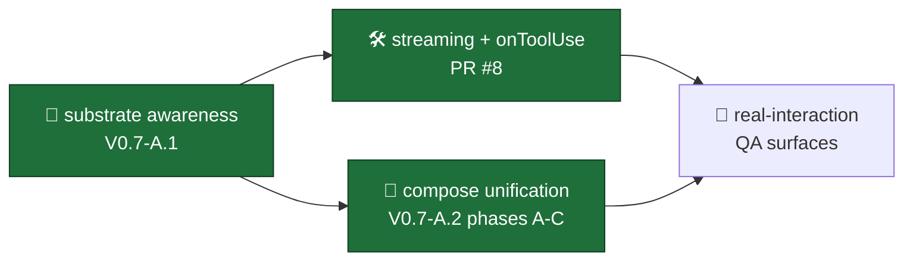

# QA · WITNESS first-run · V0.7-A.1 + V0.7-A.2 combined cycle · 2026-05-02

> Operator-facing real-interaction checklist for PR #8 (streaming + onToolUse + V0.7-A.2 compose unification). Generated via the WITNESS construct proposal (`../proposals/qa-real-interaction-construct.md`); first dogfood — does this shape produce useful surfaces?

---

## What's in scope

Three bundles to validate together:

🟢 **shipped (smoke-verified)** — typecheck clean · 4 cross-sprint smokes all green
🟡 **operator-bounded (this checklist)** — go run these in dev guild
🔴 **deferred** — V0.7-A.3+ (shim removal · deeper post-LLM unification)

**Legend**: 🟢 shipped · 🟡 operator-bounded · 🔴 deferred · 📊 capture · ❌ triage path

---

## Surfaces to try

### 🪩 Surface 1 — `/ruggy prompt:"zone digest stonehenge"` (live tool round-trip · AC-3.1)

**Setup**: dev guild · ANTHROPIC_API_KEY + MCP_KEY + CODEX_MCP_URL set · bot running on `0efedbe` + the combined branch tip.

**What to look for** (in order of importance):
- 🟢 **No tool-call JSON leaks in message text** — if the SDK is properly round-tripping, `result.success.result` carries only the synthesized final text
- 🟢 **Progressive Discord PATCH shows `📊 pulling zone digest…` during round-trip** — onToolUse callback firing means SDK observed real `tool_use` block (not LLM faking)
- 🟢 **Final message contains real digest data** (event count, miberas count, factor moves, top-mover cite) — proves tool round-trip completed and data synthesized
- 🟢 **Voice register holds** — lowercase, "yo team", zone emoji 🗿, no Title Case section headers
- 🟢 **Trajectory log includes `mcp__score__get_zone_digest`** — search `.run/audit.jsonl` or trajectory dir

**Capture**:
- 📊 Screenshot the Discord message
- 📊 Save trajectory: `grimoires/loa/qa/captures/surface-1-ruggy-zone-digest.{png,jsonl}`
- 📊 Note the `tool_uses[]` count from orchestrator meta (logged at INFO)

**Triage**:
- ❌ JSON leaks but progressive PATCH never appeared → onToolUse not firing → SDK isn't emitting `assistant.tool_use` blocks → LLM is faking the call (persona's "5-tool architecture" digest section bleeding into chat) → next fix: scope persona's REWRITE ARCHITECTURE section to cron mode only
- ❌ Progressive PATCH shows tool name but final message has no data → SDK round-trip incomplete (maxTurns hit OR tool error) → check trajectory for SDK error subtype
- ❌ Final message is generic non-grounded reply → env block missing → check `getZoneForChannel` resolution at `dispatch.ts:243`
- ❌ "Cables got crossed" / in-character error → check ANTHROPIC_API_KEY + CHAT_MODE resolution (default `auto` → orchestrator only when anthropic)

**Goals validated**: G-1 (zone identity) · G-2 (chat MCP scope) · G-3 (rosenzu place + moment) · PR #8 streaming

---

### 🐝 Surface 2 — `/satoshi prompt:"who is the grail of crossings?"` (live codex tool · AC-3.2)

**Setup**: same as Surface 1.

**What to look for**:
- 🟢 **Progressive PATCH shows `🏆 checking grail…`** during round-trip
- 🟢 **Reply cites Grail #4488 (Satoshi-as-Hermes) accurately** — Mercury · psychopompos · the crossing itself
- 🟢 **Voice register is satoshi**: sparse, gnomic, dense block, full sentences, NO one-word sentences, NO ruggy-shape ("yo team" / "stay groovy")
- 🟢 **Trajectory log includes `mcp__codex__lookup_grail`** with `{grail_id: 4488}` or similar args

**Capture**:
- 📊 Screenshot · trajectory · `tool_uses[]` count

**Triage**:
- ❌ Reply uses ruggy register → satoshi voice fidelity regressed → revert + iterate via /voice workshop (per spec gate line 567)
- ❌ Reply cites wrong grail (or made one up) → codex MCP not registered (CODEX_MCP_URL unset) OR LLM faking → check tool_uses count
- ❌ No progressive PATCH → naive path (CHAT_MODE=naive OR LLM_PROVIDER=bedrock + auto resolution) → expected if satoshi runs Bedrock; flag as F11 surface (mixed-provider asymmetry)

**Goals validated**: G-2 (chat MCP scope) · G-4 (persona governs invocation) · G-5 (voice fidelity)

---

### 🐻 Surface 3 — `/ruggy prompt:"what are people up to in bear-cave?"` (rosenzu place + moment · G-3)

**Setup**: invoke from `#bear-cave` channel in dev guild.

**What to look for**:
- 🟢 **Progressive PATCH shows `👀 reading the room…` AND/OR `🧭 orienting in zone…`** — rosenzu's read_room or get_current_district fired
- 🟢 **Reply grounds in bear-cave specifically** (Freetekno register, rig/kettle/UV-strip vocabulary, OG era)
- 🟢 **Reply references room read** (temperature, density, vibe) without restating the env block

**Capture**:
- 📊 Screenshot · note which rosenzu tool fired

**Triage**:
- ❌ Reply uses Stonehenge register from Surface 1 → channel-zone resolution wrong → check `getZoneForChannel(config, channelId)` returned `'bear-cave'`
- ❌ No rosenzu tool in trajectory → ruggy's persona didn't reach for it → tune `tool_invocation_style` (env-block tool guidance is the operator-mutable layer)

**Goals validated**: G-1 (zone identity) · G-3 (rosenzu place + moment)

---

### 🧪 Surface 4 — `CHAT_MODE=naive` revert (AC-3.5 + V0.9.1 fallback path)

**Setup**: redeploy with `CHAT_MODE=naive` env var override.

**What to look for**:
- 🟢 **Progressive PATCH does NOT appear** — naive path has empty tools, onToolUse never fires
- 🟢 **No tool calls in final reply** — text-only response from persona memory
- 🟢 **Voice register intact** — naive path still loads the env block (from V0.7-A.1) but tools aren't available
- 🟢 **Reply is honest about constraint** — ruggy might say "I'd need to pull X but tooling's off this round" or similar in-character framing

**Capture**:
- 📊 Compare side-by-side with Surface 1 output (orchestrator path)

**Triage**:
- ❌ Tools STILL fire in naive mode → routing decision broken → check `shouldUseOrchestrator(config)` at compose/reply.ts
- ❌ Naive reply is generic / lacks zone grounding → env block isn't reaching naive path → check `buildEnvironmentContext` call before `buildReplyPromptPair`

**Goals validated**: AC-3.5 (CHAT_MODE=naive revert) · F11 (mixed-provider symmetry · provides expected behavior reference)

---

### 🎼 Surface 5 — V0.7-A.2 unified `compose()` doesn't break digest cron (regression)

**Setup**: stub-mode dry digest invocation: `LLM_PROVIDER=stub STUB_MODE=true CHARACTERS=ruggy ZONES=stonehenge bun run digest:once`. Production parity check: same command on a deployed bot with real keys.

**What to look for**:
- 🟢 **Stub digest output is byte-identical to pre-V0.7-A.2 baseline** — `composeZonePost` → `buildPromptPair` (now shim) → `buildPrompt` produces same template substitution
- 🟢 **Real-LLM digest output preserves voice fidelity** — gumi blind-judge baseline ≥80% strip-the-name informal
- 🟢 **All 6 cron PostType fragments still load** (digest, micro, weaver, lore_drop, question, callout) — manual test by varying `POST_TYPE` env var
- 🟢 **'reply' fragment is NOT loaded by digest path** — POST_TYPE=reply on digest path coerces to 'digest' (shim safety fallback)

**Capture**:
- 📊 stub-mode dry digest output (compare against baseline saved in `grimoires/loa/qa/captures/v07a1-baseline-*.txt`)
- 📊 3 real-LLM dry digests per character per zone (12 total) for gumi blind-judge

**Triage**:
- ❌ Stub output diverges → buildPrompt unified path has subtle mismatch → bisect `buildPromptPair` shim vs direct `buildPrompt({kind:'cron'})` calls
- ❌ Voice fidelity regresses → fragment lift was non-byte-identical → diff `<!-- @FRAGMENT: reply -->` content vs the historical `CONVERSATION_MODE_OVERRIDE` constant

**Goals validated**: G-5 (voice fidelity) · V0.7-A.2 cycle close gate

---

### 🤝 Surface 6 — Eileen async review handoff (operator-bounded · coordination)

**What to share**:
- PR #8 link (combined cycle)
- The two persona.md fragments (ruggy + satoshi `<!-- @FRAGMENT: reply -->` content) — confirm byte-identical to historical `CONVERSATION_MODE_OVERRIDE` (cite git diff)
- The affirmative-blueprint persona prose paragraphs (V0.9.0 Phase E content) — confirm gumi-correct discipline preserved
- The compose unification kickoff brief (`grimoires/loa/specs/build-compose-unification-v07a2.md`) — confirm reframe matches V0.7-A.1 substrate canon

**What to ask**:
- 🟡 Does the fragment lift preserve voice intent?
- 🟡 Does `tool_invocation_style` text read as continuation of each character's register?
- 🟡 Should /voice workshop run before Phase E shim removal?

**Capture**:
- Eileen's response logged in `grimoires/loa/NOTES.md` Decision Log

---

### 🎨 Surface 7 — gumi blind-judge strip-the-name (operator-bounded · voice fidelity gate)

**Process**:
1. Generate 3 dry-run digests per character per zone (24 total: ruggy × 4 zones × 3 + satoshi × 4 zones × 3) using real-LLM (`LLM_PROVIDER=anthropic STUB_MODE=false`)
2. Generate 3 dry-run chats per character (`/ruggy prompt:"…"` × 3 + `/satoshi prompt:"…"` × 3 = 6 total)
3. Strip character names + character emojis from each output
4. Send anonymized samples to gumi for blind classification
5. Score: ≥80% correctly attributed → voice fidelity holds

**Capture**:
- Anonymized samples + gumi verdict at `grimoires/loa/qa/captures/v07a2-blind-judge-2026-05-02.md`

**Triage**:
- ❌ Below 80% → voice fidelity regressed → STOP at phase boundary per spec line 567 → revert PR #8 Phase A/B/C; iterate via /voice workshop

**Goals validated**: G-5 (voice fidelity) · companion-spec strip-the-name baseline

---

## Summary scoring

After running all 7 surfaces:

| surface | shipped? | result | capture path | goal IDs |
|---|---|---|---|---|
| 1 · `/ruggy zone digest?` | 🟡 needs run | (TBD) | `surface-1-ruggy-zone-digest.{png,jsonl}` | G-1, G-2, G-3 |
| 2 · `/satoshi grail?` | 🟡 needs run | (TBD) | `surface-2-satoshi-grail.{png,jsonl}` | G-2, G-4, G-5 |
| 3 · `/ruggy bear-cave?` | 🟡 needs run | (TBD) | `surface-3-ruggy-bearcave.{png,jsonl}` | G-1, G-3 |
| 4 · `CHAT_MODE=naive` | 🟡 needs run | (TBD) | `surface-4-naive-fallback.{png,jsonl}` | AC-3.5, F11 |
| 5 · digest regression | 🟡 needs run | (TBD) | `surface-5-digest-regression.txt` | G-5, V0.7-A.2 close |
| 6 · Eileen handoff | 🟡 async | (TBD) | NOTES.md Decision Log entry | coordination |
| 7 · gumi blind-judge | 🟡 async | (TBD) | `v07a2-blind-judge-2026-05-02.md` | G-5 |

🛑 **STOP merge if**:
- ❌ Surface 1 OR 2 shows tool-call JSON leak (PR #8 didn't fix it)
- ❌ Surface 5 shows digest voice regression (V0.7-A.2 unification broke fragments)
- ❌ Surface 7 < 80% correct attribution (voice fidelity regressed)

🟢 **Merge OK if**:
- 🟢 Surfaces 1-5 land their 🟢 expected behaviors
- 🟢 Surface 6 + 7 are queued (ratification can be post-merge)

---

## WITNESS first-run reflection (operator question to consider)

Did this checklist actually generate useful real-interaction surfaces?

**Useful signals**:
- Each surface has a specific COMMAND, EXPECTED behavior, CAPTURE plan, and TRIAGE path
- The 🟢/🟡/🔴 + 📊/❌ legends compose with /smol register
- The structure is reusable — V0.7-A.3 cycle close can use the same template
- Bridgebuilder findings (F5 live ACs, F11 mixed-provider) get explicit surface coverage instead of buried-in-PR-text

**Less useful**:
- Hand-rolled — every cycle close, this is regenerated from scratch. Automation would help.
- Some triage paths are speculative (we haven't observed the failure mode yet)
- Doesn't auto-discover new surfaces from the diff — operator has to think through what to test

**Recommendation**: WITNESS works at this fidelity. Promote to a real Loa skill at `.claude/skills/witness/` in V0.7-A.3 — auto-extract surfaces from PR diff + ACs + bridgebuilder findings.

---

*Generated by hand-rolled WITNESS first-run · 2026-05-02 · V0.7-A.1 + V0.7-A.2 combined cycle · pattern reference: `grimoires/loa/proposals/qa-real-interaction-construct.md`*
