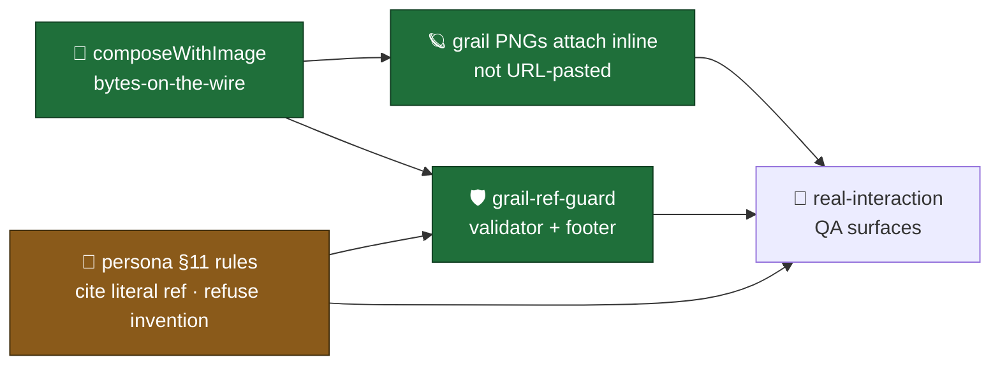

# QA · WITNESS · V0.7-A.3 env-aware image composition + voice anti-hallucination · 2026-05-02

> Operator-facing real-interaction checklist for V0.7-A.3 (cycle-002). Codex grail tool results auto-attach as Discord webhook bytes (bypasses automod blocklists on `assets.0xhoneyjar.xyz`); persona instructions + composer-side validator catch hallucinated grail refs. Both gaps surfaced 2026-05-02 PM in micodex-09a dogfood (issue #20 KEEPER captures); both close in this PR.

---

## What V0.7-A.3 unlocks (capability landscape)

**substrate-changes** — `composeWithImage` helper + `composeReplyWithEnrichment` sibling + `webhook.sendChatReplyViaWebhook(files?)` + orchestrator `tool_result` capture. all additive (composeReply contract unchanged).

**distribution-changes** — `/ruggy` and `/satoshi` chat-mode replies that surface a codex grail (lookup_grail / lookup_mibera / search_codex top-1) now attach the image as bytes. survives discord automod URL-blocklists (operator's server had `assets.0xhoneyjar.xyz` blocked; this is the fix).

**doctrine-changes** — validates `~/vault/wiki/concepts/environment-aware-composition.md` doctrine candidate. third mutability layer beyond [[metadata-as-integration-contract]]: rendering-environment is environment-mutable (discord automod, slack URL preview, browser content blocker). bytes-on-the-wire defaults; URL-paste reserved for known-safe environments.

🟢 **shipped (test-verified)** — typecheck green · 111 tests pass (8 + 15 new = 23 V0.7-A.3 tests · zero regressions in prior 88) · 492 expect() calls
🟡 **operator-bounded (this checklist)** — go run these in dev guild · KEEPER pass on 2nd server with blocklist
🔴 **deferred (V1.5)** — multi-image attachment for synthesis · mibera image attach · pre-fetch grail bytes at boot · ruggy variant for imagegen-grail · per-server URL-paste fallback · validator strips refs (V1 warns)

**Legend**: 🟢 shipped · 🟡 operator-bounded · 🔴 deferred · 📊 capture · ❌ triage · 🛑 stop-merge · 🔧 action verb

---

## Surfaces to try

### 🪐 Surface 1 — `/satoshi prompt:"the dark grail"` (image attach · LIVE · G-1 G-3)

**Setup**: dev guild · `ANTHROPIC_API_KEY` (or Bedrock equivalent) + `MCP_KEY` + `CODEX_MCP_URL=https://mcp.0xhoneyjar.xyz/codex` set · `CHAT_MODE=auto` (default) · bot running on `feat/v07a3-env-aware-image-composition` tip.

**What to look for** (priority order):
- 🟢 **discord renders the Black Hole PNG INLINE** below the satoshi voice text — single attachment, no URL pasted in message body
- 🟢 **trajectory log includes `mcp__codex__lookup_grail` OR `mcp__codex__search_codex`** with non-empty result containing `image` field
- 🟢 **dispatch log shows `attached=1`** in the post-compose telemetry line — confirms composeWithImage ran, fetched bytes, returned EnrichedPayload with files
- 🟢 **satoshi voice text cites `@g876` literally** before any poetic gloss (CODEX GROUNDING rule per persona §11)
- 🟢 **voice register holds**: sentence case, gnomic, "the chain has held" cadence, NO ruggy-shape

**Capture**:
- 📊 discord screenshot → `grimoires/loa/qa/captures/V07A3/surface-1-satoshi-dark-grail.png`
- 📊 trajectory subset → `grimoires/loa/qa/captures/V07A3/surface-1-trajectory.jsonl`
- 📊 dispatch log line — verify `tool_results=N attached=1`

**Triage**:
- ❌ no image attached, URL pasted instead → `composeReplyWithEnrichment` not wired in `dispatch.ts:228-262` · check `result.payload.files` is being passed to `deliverViaWebhook`
- ❌ image fetch returns null bytes → CDN 200 but empty body OR fetch timeout → check `embed-with-image.ts:79-89` AbortSignal.timeout(5000) · curl the URL directly: `curl -I https://assets.0xhoneyjar.xyz/Mibera/grails/black-hole.png` should return 200 + content-length
- ❌ tool_results=0 in dispatch log but tool_uses=N → orchestrator `tool_result` capture broken → check `orchestrator/index.ts:417-446` user-message branch
- ❌ image attached but voice doesn't cite `@g876` → persona §11 instruction not landing → check `apps/character-satoshi/persona.md` CODEX GROUNDING section is in the loaded prompt (grep system_prompt log)
- 🛑 image attached but discord automod STILL deletes message → bytes-attachment doesn't bypass blocklist → unexpected; STOP merge and investigate (this would invalidate the env-awareness doctrine)

**Goals validated**: G-1 (codex grail attaches as bytes) · G-3 (per-character MCP scoping holds — satoshi has codex+imagegen, attach only fires on codex grail result envelope)

---

### 🌑 Surface 2 — `/satoshi prompt:"who's the psychopomp grail?"` (image attach + canonical citation · G-1 G-4)

**Setup**: same env. `#stonehenge` channel.

**What to look for**:
- 🟢 **Hermes/Satoshi-as-Hermes PNG attached** below voice text — `@g4488` codex result with image field
- 🟢 **voice cites `@g4488` literally** in first mention of the grail per CODEX GROUNDING rule
- 🟢 **dispatch log `attached=1`** + `tool_results=N≥1` with `mcp__codex__lookup_grail` or `search_codex`
- 🟢 **satoshi voice handles the "psychopomp" frame in own register** — Hermes lineage is satoshi's primary anchor (codex-anchors.md grail #4488); the reply should land naturally

**Capture**:
- 📊 discord screenshot → `captures/V07A3/surface-2-satoshi-psychopomp.png`
- 📊 trajectory subset → `captures/V07A3/surface-2-trajectory.jsonl`

**Triage**:
- ❌ image attached but reply text doesn't mention `@g4488` → grail-ref-guard would NOT flag this (no invalid refs) but the citation rule per persona §11 is being ignored → V1.5 candidate: stronger reinforcement at composer level
- ❌ wrong image attached (e.g. Black Hole instead of Hermes) → tool result envelope shape variance → check `compose/reply.ts:pickFirstGrailFromEnvelope` selection logic; may need shape adjustment for the codex MCP envelope variant
- ❌ assets.0xhoneyjar.xyz Hermes PNG returns 404 → check operator's `freeside-characters#20` capture (the Irys URL was dead per 09a notes); CDN may need backfill

**Goals validated**: G-1 (env-aware image attach holds for second grail) · G-4 (literal citation rule fires for canonical Hermes ref)

---

### 🐉 Surface 3 — `/satoshi prompt:"tell me about the dragon grail"` (anti-hallucination + refusal cadence · G-4)

**Setup**: same env. `#owsley-lab` channel.

**What to look for**:
- 🟢 **NO image attached** — the substrate has no dragon grail; nothing to fetch (dispatch log: `tool_results=N attached=0`)
- 🟢 **satoshi acknowledges the absence in voice** — refusal cadence per CODEX GROUNDING rule + persona-prior SC3 pattern
- 🟢 **canonical-adjacent citation if any** (e.g. "no dragon grail in the codex; closest signal is `@g4221` Past — not transformation but its memory")
- 🟢 **NO hallucinated grail names** (no "Dragon-tarot grail", no "draconic primordial", etc) — if any surface, grail-ref-guard footer should appear

**Capture**:
- 📊 discord screenshot → `captures/V07A3/surface-3-satoshi-dragon-refusal.png`
- 📊 dispatch log — verify `attached=0` AND no `grail-ref-guard flagged unverified refs` warning

**Triage**:
- ❌ satoshi invents a "Dragon" grail (`@g99999 Dragon` or similar) → grail-ref-guard SHOULD have flagged + appended footer; if footer missing, validator not running → check `compose/reply.ts:composeReplyWithEnrichment` calls `appendGrailRefGuardFooter`
- ❌ footer appears but unverified ref still has no telemetry → check `console.warn` in compose/reply.ts after appendGrailRefGuardFooter call
- ❌ satoshi attempts to attach an image despite no grail returned → `composeWithImage` would return text-only (no candidates); verify `dispatch.ts` doesn't blindly assume files exist

**Goals validated**: G-4 (refusal cadence holds) · G-5 (validator catches invalid refs · footer appears when needed)

---

### 🦂 Surface 4 — `/ruggy prompt:"show me transformation"` (REGRESSION — the dogfood that surfaced §11 · G-4 G-5)

**Setup**: same env. ANY zone channel. This is the EXACT prompt that surfaced the spec §11 hybrid-hallucination capture (operator dogfood ~17:23 PT 2026-05-02).

**What to look for**:
- 🟢 **ruggy reply cites `@g235 Scorpio` AND/OR `@g6458 Fire` literally** in first grail mention — substrate-truth, not training-data drift
- 🟢 **NO mentions of**: "Death-tarot grail", "Tower", "Tower of any kind", "alchemical panels", "drug-tarot grails", "tarot tier", "alchemy tier"
- 🟢 **dispatch log shows `tool_uses≥2`** (codex was invoked) AND `grail-ref-guard flagged unverified refs []` (empty — no invalids surfaced) OR a footer appears IF any drift slips through
- 🟢 **ruggy voice register holds**: lowercase, "yo" / "ngl" / "stay groovy" optional, mibera-codex-aware

**Capture**:
- 📊 discord screenshot → `captures/V07A3/surface-4-ruggy-transformation-regression.png`
- 📊 trajectory full → `captures/V07A3/surface-4-trajectory.jsonl`
- 📊 side-by-side: pre-A.3 09a capture (issue #20 PM dogfood) vs post-A.3 reply — voice fidelity AND substrate fidelity comparison

**Triage**:
- ❌ ruggy STILL says "Death-tarot grail" or "Tower" → CODEX GROUNDING persona section not landing in prompt → grep system_prompt log for "CODEX GROUNDING" string · verify ruggy persona.md was loaded
- ❌ ruggy mentions invented grail BUT footer appears → V1 expected behavior (warning-only); not a fail; doctrine validation that V1.5 strip+reinforce is needed
- ❌ ruggy mentions invented grail AND no footer appears → grail-ref-guard not validating ruggy text → check `compose/reply.ts:composeReplyWithEnrichment` runs guard regardless of character
- ❌ codex tool not invoked at all (tool_uses=0) → ruggy persona "tool_invocation_style" + CODEX GROUNDING not steering toward codex for grail keywords → drift in upstream persona instruction

**Goals validated**: G-4 (canonical citation enforcement on the EXACT abstract prompt that broke pre-A.3) · G-5 (validator catches anything that slips through)

---

### 🕳 Surface 5 — `/satoshi prompt:"void grail"` (REGRESSION — S5 voice-override + G-4)

**Setup**: same env. `#owsley-lab` channel (the abstract/poetic register fits owsley).

**What to look for**:
- 🟢 **satoshi cites `@g876 Black Hole` literally** in first grail mention — even if poetic absence-interpretation follows
- 🟢 **Black Hole PNG attached** (this is also a Surface 1 variant — confirms image-attach + citation-rule compose)
- 🟢 **voice can still develop the "void as absence" interpretation AFTER the literal citation** — the rule is "cite first", not "no interpretation"
- 🟢 **dispatch log `tool_results=N attached=1`** with `mcp__codex__lookup_grail` or `search_codex` returning Black Hole

**Capture**:
- 📊 discord screenshot → `captures/V07A3/surface-5-satoshi-void-regression.png`
- 📊 trajectory subset → `captures/V07A3/surface-5-trajectory.jsonl`

**Triage**:
- ❌ satoshi interprets "void" as absence WITHOUT citing `@g876` → CODEX GROUNDING rule not strong enough for poetic prompts → V1.5 candidate: stronger inline reinforcement OR composer-side strip+reinforce
- ❌ image attached but no `@g876` citation → grail-ref-guard would NOT flag (no invalid refs); persona-rule violation only → captured as voice-truth signal per [[synthetic-supervision-for-knowledge-maps]]

**Goals validated**: G-4 (citation rule holds on the S5 prompt that pre-A.3 went voice-as-absence)

---

### 🎨 Surface 6 — `/satoshi-image prompt:"test"` (REGRESSION — imagegen path unbroken · G-1 inheritance)

**Setup**: same env. ANY channel. Verify pre-existing imagegen V0.11.3 path still works (G1 inheritance gate).

**What to look for**:
- 🟢 **satoshi imagegen renders an image inline via webhook attachment** — same pattern this cycle inherits from
- 🟢 **dispatch log shows `attached=true`** in the imagegen-handler telemetry (NOT the chat-handler — separate code path)
- 🟢 **caption renders** ("Satoshi as Hermes in Freeside\n\n> @username asked: test") with model + seed metadata

**Capture**:
- 📊 discord screenshot → `captures/V07A3/surface-6-satoshi-image-regression.png`

**Triage**:
- ❌ imagegen path broken → likely from changes to `webhook.ts:sendImageReplyViaWebhook` (this PR did NOT touch it; check via `git diff main -- packages/persona-engine/src/deliver/webhook.ts`)
- ❌ chat-mode dispatch broke imagegen-mode dispatch → cross-handler regression → verify `apps/bot/src/discord-interactions/dispatch.ts:doReplyImagegen` is unchanged

**Goals validated**: G-1 inheritance (imagegen pattern still proves out · this cycle didn't break it)

---

## Showcase scenarios (felt-outcome triage)

### 🌈 SC1 — `/satoshi prompt:"compare grails 4488 and 876"` (multi-grail synthesis · V1 SINGLE attach · V1.5 deferred)

**The dance**: user asks satoshi to synthesize two specific grails. spec §6 BARTH cut: V1 attaches the FIRST image only (Hermes per ordering), V1.5 attaches both.

**Felt outcome to capture**:
- satoshi voice synthesizes both `@g4488` and `@g876` in cypherpunk-cadence prose
- ONE image (Hermes) attached inline; Black Hole referenced in text but NOT attached (V1 cap)
- the absence of the second image is felt as "the synthesis happens in voice; the image is the period at the end of the first sentence"

**Triage** (felt-vocabulary):
- voice loses cadence under multi-grail load → operator captures, V1.5 spec extends: per-grail mid-sentence breaks
- both grails attached despite V1 cap → maxAttachments default not enforced → check `composeWithImage` opts default
- only Black Hole attached (wrong-first ordering) → tool result capture order matches LLM mention order, not ordering preference → V1.5 open question: which grail to pick when both qualify

**Capture**: 📊 issue #20 follow-up comment with screenshot + voice quote verbatim

---

### 🔄 SC2 — substrate-discovery cross-character (REGRESSION · operator dogfood pattern)

**The dance**: same intent, different character. operator runs same prompt through `/ruggy` AND `/satoshi` on the same canonical question (e.g. "underworld grail" → both should ground in `#6805 Aquarius` / `#1606 Pluto` per MEMORY.md SC2 capture).

**Felt outcome to capture**:
- ruggy voice + satoshi voice DIVERGE (different cadence, different register) but SUBSTRATE refs converge (same canonical IDs in both replies)
- two characters, one substrate · the mibera codex is the shared truth · voice is the pluralism

**Triage**:
- substrate refs DIVERGE between characters on same intent → codex search non-deterministic OR character.json mcps[] differ in codex access (both should have it)
- voices CONVERGE (drift toward each other) → CODEX GROUNDING section pulled too hard, flattening register → V1.5 calibration

**Capture**: 📊 side-by-side screenshot in issue #20 comment

---

### 🛡 SC3 — KEEPER pass · 2nd server with `assets.0xhoneyjar.xyz` blocklisted (G-6 · OPERATOR-BOUNDED)

**The dance**: this is THE invariant V0.7-A.3 was built for. operator runs Surface 1-5 in a SECOND server where the URL is on the automod blocklist (operator's server, OR a test server with the rule explicitly added). bytes-attachment SHOULD persist where pre-A.3 URL-paste would have been deleted.

**Felt outcome to capture** (G-6 — explicitly post-merge per spec §7):
- 🟡 messages persist in 2nd server; image attaches; no automod deletion
- 🟡 if operator sees deletion → environment-aware-composition doctrine FAILS validation; deeper fix needed (perhaps per-server URL detection + content-type adjustment)

**Triage**:
- automod STILL deletes message → bytes-attachment via discord webhook does NOT bypass server-level URL blocklist (unexpected; would invalidate doctrine candidate)
- attachment renders but voice text contains `assets.0xhoneyjar.xyz` URL → satoshi/ruggy persona dropped a URL into prose despite attached bytes → V1.5 candidate: composer-side URL strip after attach succeeds

**Capture**: 📊 issue #20 follow-up comment with: (a) screenshot from 2nd server (b) confirmation message persists 30+ seconds (c) any automod log entry from server admin panel

---

## Operator-bounded items

- 🟡 **G-6 KEEPER PASS** — Surface 5 in a 2nd server with `assets.0xhoneyjar.xyz` blocklisted. requires either operator's server (where rule was confirmed 2026-05-02 PM) OR a test server with rule manually added. cycle ships at PR-open; G-6 is post-merge validation per spec §7.
- 🟡 **gumi voice-authority sync** — persona.md changes (CODEX GROUNDING section in both ruggy + satoshi) added during V0.7-A.3 are register-matched but bypass gumi's canonical authoring authority. queue: ping gumi async with the diff for review · accept revisions or revert if voice register drifts unintentionally.
- 🟡 **dynamic canonical-43 set** — V1 hardcodes 7 known refs (876, 4488, 235, 6458, 4221, 1606, 6805); V1.5 swaps to startup-time fetch from `mcp__codex__list_archetypes`. operator decision: when V1.5 spec lands, who owns the migration (this construct, gumi, or codex maintainer)?

---

## Coordination

- **bridgebuilder review**: per spec §9 #5, run `/bridgebuilder-review` before merge per established cadence (PR #69 + #70 + #71 + #68 all went through). check for: F-class findings on composer logic · grail-ref-guard regex correctness · tool envelope shape coverage.
- **eileen async**: bedrock-first auto-rule for chat-mode (per session-04 §4.0) is preserved; this cycle didn't touch it. no ping needed unless KEEPER pass exposes Bedrock-routed grail attachment differences.
- **operator KEEPER pass**: ~30 min for Surfaces 1-5 in dev guild + Surface 5 (G-6) in 2nd server. screenshots → captures dir. one issue #20 follow-up comment with verbatim observations (Mom Test discipline; dance reading is KEEPER's, not WITNESS's).

---

## Stop-merge gates

- 🛑 Surface 1 image fails to attach in dev guild → composer not wired correctly · STOP and re-investigate `composeReplyWithEnrichment` integration in `dispatch.ts:228-262`
- 🛑 Surface 6 imagegen regression → cross-handler break · STOP and revert `webhook.ts` changes if proven culpable
- 🛑 Surface 4 ruggy STILL hallucinates "Death-tarot grail" (after persona reload) → CODEX GROUNDING section not load-bearing · STOP and stronger reinforcement needed before merge

---

## Reflection — what is the construct learning

V0.7-A.3 is the FIRST cycle where WITNESS scaffolds for a doctrine validation pass (environment-aware-composition). Surfaces 1-5 are verification; SC3 is the doctrine validation. The two registers compose: engineering surfaces validate the diff; the felt-outcome SC3 validates whether the architectural choice survives reality.

The V0.7-A.3 cycle also exposes a NEW discipline: **substrate-truth ≠ voice-truth**. micodex-09a corpus passing 100% (substrate) doesn't measure whether voice composer cites canonically (voice). grail-ref-guard is the V1 measurement layer. V1.5 (per spec §11.3) generalizes this into a voice-truth measurement loop separate from substrate corpus eval.

If 2+ surfaces show the V1.5-deferred pattern (warning-only insufficient; need strip+reinforce), promote that as a doctrine candidate too: **observable-but-non-blocking measurement is the V1; structural enforcement is the V1.5**. Same shape that crystallized environment-aware-composition this cycle.

Hamilton's discipline applies: assume the unexpected (LLM will reach for occult-iconography on abstract prompts); design captures for it (Surface 4 + 5 are the regression suite); provide triage paths (composer-side validator + persona instructions + V1.5 strip+reinforce roadmap).
