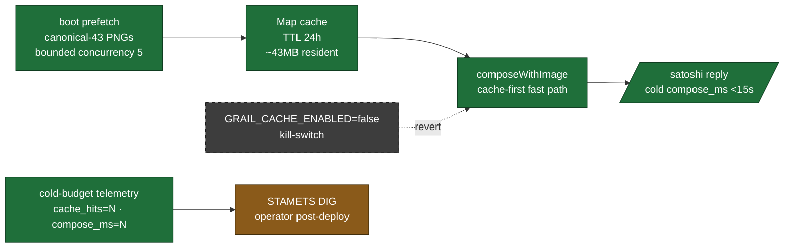

# QA · WITNESS · V0.7-A.4 prefetch grail bytes (close cold-latency) · 2026-05-02

> Operator-facing real-interaction checklist for V0.7-A.4 (cycle-003). Boot-time prefetch warms the canonical-grail PNG bytes so the first slash-command call after deploy doesn't pay the CDN-cold cost (~1-3s) on top of Bedrock-cold (~5-10s) + qmd-cold (~5-15s). Operator-felt friction "feels a bit slow" surfaced 2026-05-02 ~21:08 PT in V0.7-A.3 dogfood (cold compose_ms=27965 vs spec budget 15s) — V0.7-A.4 closes the substrate-side contributor and ships telemetry so STAMETS DIG can confirm post-deploy.

---

## What V0.7-A.4 unlocks (capability landscape)

**substrate-changes** — `grail-cache.ts` module (Map + TTL + bounded-concurrency boot prefetch + concurrent-init dedup) · `embed-with-image.ts` cache-first fast path + organic re-warm + `cacheHits` surfaced on `EnrichedPayload` · boot wiring in `apps/bot/src/index.ts` after Discord client connect, before interactions handler · `dispatch.ts` `[cold-budget]` telemetry log line.

**distribution-changes** — none directly. `/ruggy` and `/satoshi` chat replies that surface a codex grail get the bytes from cache (microsecond Map lookup) instead of CDN (1-3s cold) on cold first calls. operator-felt friction resolves; substrate is invisible to user-facing surface.

**doctrine-changes** — extends [[environment-aware-composition]] (V0.7-A.3 doctrine) with cache-strategy operator-side flexibility. bytes-on-the-wire ownership now also means "owned at boot, not just at delivery." Composes with [[metadata-as-integration-contract]] — URL stays operator-mutable; cache is operator-owned warming layer.

🟢 **shipped (test-verified)** — typecheck green · 186 persona-engine tests pass (162 baseline + 24 new V0.7-A.4 tests) · 46 apps/bot tests pass (zero regressions) · 657 expect() calls · kill-switch testable in isolation
🟡 **operator-bounded (this checklist)** — go run these in dev guild · STAMETS DIG measurement post-deploy · KEEPER pass on cold→warm pair
🔴 **deferred (V1.5)** — LRU eviction · disk-backed cache · signal-based invalidation (codex MCP webhook on grail update) · mibera image cache (10K resident) · archetype/zone image cache · pre-warm Bedrock + qmd as well · dynamic URL discovery via `mcp__codex__list_archetypes`

**Legend**: 🟢 shipped · 🟡 operator-bounded · 🔴 deferred · 📊 capture · ❌ triage · 🛑 stop-merge · 🔧 action verb

---

## Surfaces to try

### 🌑 Surface 1 — bot boot log shows cache warm-up (G-1)

**Setup**: dev guild · `ANTHROPIC_API_KEY` (or Bedrock equivalent) + `MCP_KEY` + `CODEX_MCP_URL=https://mcp.0xhoneyjar.xyz/codex` set · `CHAT_MODE=auto` (default) · bot running on `feat/v07a4-prefetch-grail-bytes` tip · deploy fresh.

**What to look for** (priority order):
- 🟢 **bot boot log includes line** `grail-cache:    init N/M cached in Xms` between the `discord:` and `interactions:` lines
- 🟢 **N=M** for healthy CDN (all V1 7 grails warmed) · or **N<M with `(K failed · live-fetch fallback)` suffix** if some PNGs 404
- 🟢 **X<10000** (boot delay <10s for V1 7-grail set per spec §2 invariant 5)
- 🟢 **cache failures DON'T crash the bot** — the log keeps going, interactions handler still starts

**Capture**:
- 📊 stdout/CloudWatch boot log — verify the `grail-cache:` line exists + values reasonable
- 📊 `process.memoryUsage().heapUsed` if available — should be ~43MB additional vs no-cache baseline (V1 7-grail set: ~7MB · V1.5 canonical 43: ~43MB)

**Triage**:
- ❌ no `grail-cache:` line at all → boot wiring missing → check `apps/bot/src/index.ts` import + call placement (after Discord connect, before interactions)
- ❌ N=0/M=7 with all "prefetch failed status=404" — wrong CDN paths in CANONICAL_GRAIL_URLS → check actual paths via `curl -I https://assets.0xhoneyjar.xyz/Mibera/grails/black-hole.png` and update the constant
- ❌ X>15000 (slow prefetch) → CDN slow OR concurrency too low → check cache config (default 5 parallel) · consider bumping to 10
- ⚠️ boot log says `DISABLED (GRAIL_CACHE_ENABLED=false ...)` → kill-switch is on; this is intentional revert, not a bug

**Goals validated**: G-1 (boot prefetch warms before interactions accepts traffic)

---

### 🪐 Surface 2 — `/satoshi prompt:"the dark grail"` cold first call (G-2 · G-7)

**Setup**: same env. `#stonehenge` channel. Run IMMEDIATELY after bot boot — first slash invocation since deploy.

**What to look for**:
- 🟢 **dispatch log shows `[cold-budget] character=satoshi compose_ms=N tool_uses=N tool_results=N attached=N cache_hits=N text_len=N`**
- 🟢 **`cache_hits=1`** (or matches `attached`) — cache served the Black Hole PNG bytes
- 🟢 **`compose_ms < 15000`** (was ~28000 in V0.7-A.3 cold) — spec §2.5 budget closure
- 🟢 **discord renders the Black Hole PNG INLINE** below satoshi voice (V0.7-A.3 surface still works · zero regression)
- 🟢 **satoshi voice cites `@g876`** (V0.7-A.3 anti-hallucination still works · zero regression)

**Capture**:
- 📊 `[cold-budget]` log line subset — `grimoires/loa/qa/captures/V07A4/surface-2-cold-budget.txt`
- 📊 discord screenshot if image renders → `captures/V07A4/surface-2-satoshi-dark-grail-cold.png`

**Triage**:
- ❌ `cache_hits=0` despite cache enabled → cache lookup not wired in `fetchAttachment` → check embed-with-image.ts:200-220 cache-first block · verify `isCacheEnabled()` returns true at runtime · verify CANONICAL_GRAIL_URLS includes the URL the codex MCP returned for "the dark grail"
- ❌ `compose_ms > 20000` despite `cache_hits=1` → bottleneck is upstream (Bedrock cold OR qmd cold) → cache helped but isn't enough; this is STAMETS DIG signal that V1.5 needs Bedrock provisioning OR qmd warm-keeper as separate cycles
- ❌ no `[cold-budget]` log line → telemetry missing → check `dispatch.ts:411-440` block exists + ran without throw
- 🛑 `compose_ms > 30000` → regression from V0.7-A.3 baseline → STOP merge; investigate boot-time side effect on hot path

**Goals validated**: G-2 (cache-first fast path) · G-6 (cold-budget telemetry) · G-7 (post-deploy KEEPER signal)

---

### 🟢 Surface 3 — second `/satoshi prompt:"the dark grail"` warm call (G-2 · G-3)

**Setup**: IMMEDIATELY after Surface 2 succeeded. Same prompt, same channel.

**What to look for**:
- 🟢 **`cache_hits=1`** (cache hit again — same URL)
- 🟢 **`compose_ms` <8000** — Bedrock + qmd warm too at this point; cache contribution stays microseconds
- 🟢 **same image renders** below satoshi voice — bytes are byte-identical to first call (Map.get returns same Buffer)

**Capture**:
- 📊 `[cold-budget]` log line — `captures/V07A4/surface-3-warm-budget.txt`
- 📊 compare compose_ms first vs second cold→warm — both should show `cache_hits=1` but second is faster (Bedrock/qmd warmed)

**Triage**:
- ❌ second call `cache_hits=0` → cache eviction firing too aggressively → check TTL constant (24h) + getGrailBytes Date.now logic
- ❌ second call `compose_ms` not faster than first → Bedrock/qmd aren't warming OR cache isn't the cold contributor → STAMETS DIG signal that the cycle should focus on upstream warming
- ❌ image bytes differ (Discord shows different PNG) → cache stored wrong bytes; investigate `setGrailBytes` call site in embed-with-image.ts

**Goals validated**: G-2 (cache hit returns same bytes) · G-3 (organic re-warm holds across calls) · G-7 partial (warm baseline)

---

### 🔴 Surface 4 — different grail prompt warms different cache entry (G-3)

**Setup**: same env. Run a NEW prompt that triggers a different canonical grail (e.g. `/ruggy prompt:"show me transformation"` → expects `@g235 Scorpio` or `@g6458 Fire`).

**What to look for**:
- 🟢 **first time this URL is touched: `cache_hits=0`** (live-fetch path, organic re-warm fires)
- 🟢 **immediate second time same prompt: `cache_hits=1`** (organic re-warm worked)
- 🟢 **the original grail URL from Surfaces 2+3 still cache-hits** (cache holds multiple entries · no LRU eviction in V1 since image set is small)

**Capture**:
- 📊 sequence of `[cold-budget]` log lines showing `cache_hits=0` → `cache_hits=1` for the same NEW URL
- 📊 followed by re-running the original prompt → `cache_hits=1` (still cached)

**Triage**:
- ❌ original prompt suddenly `cache_hits=0` after running new prompt → cache is evicting on each new entry → check `cache.set` doesn't have a hidden capacity limit; Map should hold all entries until TTL
- ❌ new URL never makes it into cache (`cache_hits=1` never appears for the new prompt even on retry) → live-fetch path's `setGrailBytes` call isn't firing → check embed-with-image.ts:280 `if (isCacheEnabled()) setGrailBytes(...)`

**Goals validated**: G-3 (organic re-warm pattern works for non-prefetched URLs)

---

### ⚙️ Surface 5 — kill-switch `GRAIL_CACHE_ENABLED=false` reverts to V0.7-A.3 behavior (G-5)

**Setup**: redeploy bot with `GRAIL_CACHE_ENABLED=false` set. Same dev guild.

**What to look for**:
- 🟢 **bot boot log shows `grail-cache:    DISABLED (GRAIL_CACHE_ENABLED=false · live-fetch every call)`** — no prefetch fires
- 🟢 **first `/satoshi prompt:"the dark grail"` after deploy**: `[cold-budget] cache_hits=0 compose_ms ~28000` (back to V0.7-A.3 baseline)
- 🟢 **second same call**: still `cache_hits=0` (cache writes also disabled · no organic re-warm)
- 🟢 **discord image still renders** — V0.7-A.3 live-fetch substrate still works · kill-switch is reversion, not breakage

**Capture**:
- 📊 boot log DISABLED line — `captures/V07A4/surface-5-killswitch-boot.txt`
- 📊 cold-budget log showing `cache_hits=0` for both calls — `captures/V07A4/surface-5-killswitch-budget.txt`

**Triage**:
- ❌ `cache_hits` still showing >0 with kill-switch ON → env flag not respected → check `isCacheEnabled()` env-read logic at `grail-cache.ts:isCacheEnabled` · verify env var actually set in deploy environment
- ❌ bot boot still shows prefetch line → boot wiring's `if (isGrailCacheEnabled())` not respected → check `apps/bot/src/index.ts` import name + call gate
- ❌ image fails to render with kill-switch ON → V0.7-A.3 substrate has regressed (not V0.7-A.4 issue) → STOP merge; investigate `composeWithImage` live-fetch path independently

**Goals validated**: G-5 (kill-switch revert path complete · cache lookup AND cache write both bypass)

---

## Showcase scenarios (felt outcomes)

### 🎬 SC1 — operator measures cold-latency closure end-to-end

Operator runs cold → cold sequence (deploy bot, immediately fire `/satoshi`) and reads the `[cold-budget]` log. Felt outcome: image appears within ~10-12 seconds of typing the prompt (Discord deferred-thinking placeholder less jarring; voice + image arrive close together rather than with a long pause).

**Triage**:
- 🎯 felt outcome holds → V0.7-A.4 succeeded · doctrine [[environment-aware-composition]] now extends to "cache as operator-side warming layer"
- 🛑 felt outcome same as V0.7-A.3 (pause still long) → STAMETS DIG signal: CDN wasn't the dominant contributor; revert via kill-switch + investigate Bedrock provisioning OR qmd warm-keeper

### 🎬 SC2 — STAMETS DIG decision tree post-deploy

Operator collects 3-5 cold→warm pair samples from `[cold-budget]` logs across different days. From the pattern, decides:

| Pattern | Inference | Next action |
|---|---|---|
| `cache_hits>0` AND cold compose_ms ~12-15s | Cache is meaningful; budget closed | Land V0.7-A.5 multi-image cache (next cycle) |
| `cache_hits>0` AND cold compose_ms still ~25s+ | Bedrock OR qmd is dominant cold | Set `GRAIL_CACHE_ENABLED=false`, investigate Bedrock provisioning OR codex MCP qmd warm-keeper as separate cycles |
| `cache_hits=0` consistently AND compose_ms still 28s | Cache lookup broken — investigate (look like a regression) | Check fetchAttachment cache-first block; verify URL match between codex MCP returns and CANONICAL_GRAIL_URLS |

**Triage**:
- 🎯 operator has actionable signal from telemetry — STAMETS DIG outcome captured · spec §4.0 measurement loop closes
- ⚠️ telemetry doesn't surface enough granularity → V1.5 candidate: split `compose_ms` further into `mcp_rtt_ms` + `llm_rt_ms` + `fetch_ms` per spec §4.0 instrumentation hooks (deferred for time-budget reasons; same-PR ship was the trade-off)

### 🎬 SC3 — boot delay vs runtime warm tradeoff (BARTH)

Operator deploys to Railway and measures boot time. V0.7-A.4 adds ~5-10s before interactions handler accepts traffic. If Railway scale-up cadence becomes meaningful (e.g. multiple deploys/day), this is felt. Felt outcome: maybe trade boot delay for first-call delay.

**Triage**:
- 🎯 boot delay <10s and operator OK with it → ship as-is · option A wins per kickoff §4.1
- 🛑 boot delay >15s → consider option C (boot prefetch top-N + lazy for rest) as V0.7-A.4 polish OR move to lazy-only (option B) and document

---

## Operator-bounded actions

- [ ] Deploy `feat/v07a4-prefetch-grail-bytes` to dev guild
- [ ] Capture boot log for Surface 1 — paste `grail-cache:` line in PR comment
- [ ] Run Surface 2 + 3 cold→warm pair · paste `[cold-budget]` log lines
- [ ] Run Surface 4 NEW grail · confirm organic re-warm works
- [ ] Run Surface 5 kill-switch revert · confirm V0.7-A.3 baseline restored
- [ ] STAMETS DIG decision (SC2) post-deploy · update spec §0 with measured cold-budget split for V1.5 planning
