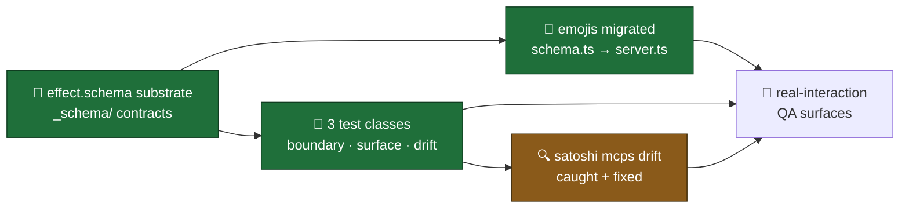

# QA · WITNESS · session-03 MCP-substrate cycle · PR #18 · 2026-05-02

> Operator-facing real-interaction checklist for PR #18 (Effect.Schema MCP contracts · emojis migrated · 3 test classes · satoshi.mcps[] expansion). Generated post-bridgebuilder review (12 findings · REQUEST_CHANGES verdict · 4 PRAISE / 2 MEDIUM / 6 LOW). Goal IDs assigned from kickoff seed §7 verify-list as `[ASSUMPTION]` since this session ran parallel to cycle-001 sprint plan.

---

## What's in scope



🟢 **shipped (test-verified)** — typecheck green · 49/49 tests pass · 113 expect() calls
🟡 **operator-bounded (this checklist)** — go run these in dev guild · resolve bridgebuilder MEDIUMs
🔴 **deferred** — handler↔schema parity (F12) · Effect→Zod runtime converter · rosenzu/freeside_auth/imagegen migrations

**Legend**: 🟢 shipped · 🟡 operator-bounded · 🔴 deferred · 📊 capture · ❌ triage · 🛑 stop-merge

---

## Surfaces to try

### 🎴 Surface 1 — `/ruggy prompt:"hit me with the bear-cave digest, drop a vibe-flag"` (broken-chat fix · LIVE verification · V-3)

**Setup**: dev guild · `ANTHROPIC_API_KEY` + `MCP_KEY` + `CODEX_MCP_URL` set · `CHAT_MODE=auto` (default) · `LLM_PROVIDER=anthropic` · bot running on PR #18 tip (`900af40`).

**What to look for** (priority order):
- 🟢 **Progressive Discord PATCH shows `🔧 picking emoji…`** mid-round-trip — onToolUse fired on real `mcp__emojis__pick_by_mood` (or `random_pick`) call
- 🟢 **Final reply contains a real custom emoji** rendered via `<:name:id>` or `<a:name:id>` syntax — NO fabricated `<:ruggy_*:fake_id>` snowflakes
- 🟢 **Emoji `name` matches an entry in `registry.ts`** (43 known: 26 mibera + 17 ruggy) — grep the message for `<a?:[a-z_]+:\d+>` and verify the name lookups via `findByName()`
- 🟢 **Trajectory log includes `mcp__emojis__pick_by_mood` OR `mcp__emojis__random_pick`** — confirms the chat-route resolved to orchestrator + ruggy got emojis MCP
- 🟢 **Voice register holds**: lowercase, "yo", zone-grounded, no Title Case, ruggy-shape

**Capture**:
- 📊 Discord screenshot → `grimoires/loa/qa/captures/session-03-mcp/surface-1-ruggy-emoji.png`
- 📊 Trajectory subset (filter `tool_uses`) → `surface-1-ruggy-trajectory.jsonl`
- 📊 `chat-route` log line — verify `useOrchestrator: true` + `mcps: [score,codex,emojis,rosenzu,freeside_auth]`

**Triage**:
- ❌ Reply has fabricated snowflake-IDs (`<:ruggy_dab:1234567890>` style with bogus digits) → orchestrator path NOT taken → grep for `[chat-route]` log line · check `useOrchestrator: false` · check `LLM_PROVIDER` resolution at `compose/reply.ts:215-221`
- ❌ Tool call fired but emoji name not in registry → `findByName()` failing → check `emojis/registry.ts` matches what `mcp__emojis__pick_by_mood` returned
- ❌ Progressive PATCH never appears → `onToolUse` callback not firing → SDK isn't emitting `assistant.tool_use` blocks → orchestrator routing broken (regression vs PR #11)

**Goals validated**: V-1 (emojis migration end-to-end) · V-3 (broken-chat fix live) `[ASSUMPTION]`

---

### 🐝 Surface 2 — `/satoshi prompt:"what's the cross-zone read this week?"` (satoshi mcps[] expansion · LIVE · V-3 + bridgebuilder F3)

**Setup**: same env as Surface 1. Dev guild. Use `#stonehenge` or any codex-mapped channel.

**What to look for** (priority order):
- 🟢 **Trajectory log includes `mcp__score__get_zone_digest`** — proves satoshi can NOW reach score (was filtered out pre-PR #18)
- 🟢 **Trajectory may also include `mcp__rosenzu__furnish_kansei` and/or `mcp__freeside_auth__resolve_wallets`** — depending on what satoshi reaches for; persona explicitly guides "your tools help you cite cleanly across zones"
- 🟢 **Reply cites real digest numbers** (event count, factor moves) instead of vague gnomic abstractions
- 🟢 **Voice register holds (CRITICAL)**: sparse, gnomic, dense block, full sentences, NO ruggy-shape ("yo team" / "stay groovy"), NO emoji
- 🟢 **`chat-route` log shows `mcps: [score,codex,rosenzu,freeside_auth,imagegen]`** (the expanded set)

**Capture**:
- 📊 Discord screenshot → `surface-2-satoshi-expanded.png`
- 📊 Trajectory subset → `surface-2-satoshi-trajectory.jsonl`
- 📊 Side-by-side: pre-PR-18 satoshi reply (from session-09 captures) vs post-PR-18 — voice fidelity comparison

**Triage**:
- ❌ Voice register drifts toward ruggy (uses lowercase emoji-laden register) → broader tool access changed register → STOP-merge or revert mcps[] to `["codex","imagegen"]` AND refactor persona.md to remove score/rosenzu/freeside_auth references (creative-direction call · needs bonfire grimoires sync per `Persona is sacred` invariant)
- ❌ Satoshi STILL can't reach score (`chat-route` log shows score missing from mcps) → character.json edit didn't propagate → restart bot · re-check `apps/character-satoshi/character.json:12` shows the 5-tool array
- ❌ Reply cites fabricated digest numbers → orchestrator path NOT taken for satoshi → `LLM_PROVIDER` for satoshi might still be bedrock-routed differently · check `routeChatLLM` matrix

**Goals validated**: V-3 (broken-chat fix · satoshi class) · `[BRIDGEBUILDER F3]` (live confirmation that the expansion is correct creative direction)

---

### 🛡️ Surface 3 — `CHAT_MODE=naive` revert hatch still works (regression · F11-class)

**Setup**: redeploy bot with `CHAT_MODE=naive` env override. Same `ANTHROPIC_API_KEY`.

**What to look for**:
- 🟢 **`chat-route` log shows `useOrchestrator: false`** for both ruggy and satoshi
- 🟢 **No progressive PATCH appears** — naive path has empty mcpServers + allowedTools
- 🟢 **Replies are text-only** — no `<:emoji:id>` rendered, no real digest numbers
- 🟢 **In-character framing for missing tools** — ruggy might say "couldn't pull X this round" rather than fabricate
- 🟢 **Voice register intact** — env block still loads via V0.7-A.1 substrate; only tools are off

**Capture**:
- 📊 Side-by-side compare with Surface 1 + 2 outputs
- 📊 Trajectory file (should have NO `tool_uses` entries) → `surface-3-naive.jsonl`

**Triage**:
- ❌ Tools STILL fire under `CHAT_MODE=naive` → routing decision broken → check `shouldUseOrchestrator(config)` returns `false` · check `compose/reply.ts:215-221` matrix
- ❌ Reply hallucinates digest numbers → persona doesn't know it's in naive mode → expected behavior (persona-prompt unchanged); future fix is env-block conditional on CHAT_MODE

**Goals validated**: revert-hatch invariant · regression coverage for surface-completeness test class assertion

---

### 📜 Surface 4 — Digest cron stub-regression (no V0.7-A.1 break)

**Setup**: from repo root with PR #18 checked out:
```
LLM_PROVIDER=stub STUB_MODE=true CHARACTERS=ruggy ZONES=stonehenge bun run digest:once
```
Then same with `CHARACTERS=satoshi`.

**What to look for**:
- 🟢 **stub digest output is byte-identical to a pre-PR-18 baseline** — `composeForCharacter` path is untouched by the schema migration (only chat-mode + `_schema/` substrate added)
- 🟢 **No new errors in stderr** — no Effect schema decode failures during digest path
- 🟢 **Both characters complete digest without crash** — emojis MCP refactor doesn't break the cron path

**Capture**:
- 📊 Output of both runs → `surface-4-digest-stub-{ruggy,satoshi}.txt`
- 📊 Diff against `grimoires/loa/qa/captures/v07a1-baseline-*.txt` if available; otherwise treat THIS run as the new baseline

**Triage**:
- ❌ Stub output diverges from baseline → emojis server.ts refactor changed runtime behavior beyond shape → bisect by reverting `emojis/server.ts` to pre-PR state (handlers were inlined; check `handleListMoods` etc. logic preserved)
- ❌ Effect decode error in cron → `_schema/runtime.ts` `decodeInput`/`decodeOutput` got called from a digest-path handler that wasn't expecting them (regression class F1 from bridgebuilder)

**Goals validated**: V-6 (no regression on digest path) `[ASSUMPTION]`

---

### 🎨 Surface 5 — Satoshi voice fidelity after mcps[] expansion (gumi blind-judge · async coordination)

**Why this surface**: bridgebuilder F3 flagged the satoshi mcps[] expansion as "behavioral change masked as a test fix." The fix matches what persona explicitly assumes, but broader tool access COULD shift voice register (e.g., satoshi reaches for score and starts citing numbers in a less-gnomic way).

**Process**:
1. Generate 3 dry-run chats per character per representative prompt — covering zone-digest / grail-lookup / wallet-resolve scenarios. 6 satoshi outputs minimum.
2. Strip character names + character emojis from each output (per V0.7-A.2 strip-the-name pattern)
3. Send anonymized samples to gumi for blind classification
4. Score: ≥80% correctly attributed → voice fidelity holds despite broader tool access

**Capture**:
- 📊 Anonymized samples + gumi verdict → `surface-5-satoshi-blindjudge-2026-05-02.md`
- 📊 Side-by-side: pre-PR-18 satoshi outputs (session-09 captures · narrow mcps) vs post-PR-18 (expanded mcps)

**Triage**:
- ❌ Below 80% correct attribution AND drift skews ruggy-ward → mcps[] expansion DID change voice → revert character.json + refactor persona.md instead (the alternative fix: remove score/rosenzu/freeside_auth references, narrow scope holds)
- ❌ Below 80% but drift is generic-LLM-ward (not ruggy) → tool-call density changed register without specific persona-leak → tune `tool_invocation_style` in character.json

**Goals validated**: `[BRIDGEBUILDER F3]` paper trail · creative-direction confirmation post-merge

---

### 🌐 Surface 6 — Cross-repo coordination (Eileen / zerker / gumi / operator handoffs)

**What to share** (per draft contents in `grimoires/loa/proposals/`):

🤝 **operator (construct-freeside owner) → §4.5 SKILL.md draft**
- Path: `grimoires/loa/proposals/registering-mcp-tenant-skill-draft.md`
- Ask: confirm naming convention matches existing 8 skills (`consuming-codex-overrides` / `coordinating-cutover` shape) · adjust frontmatter + section headers · push to `0xHoneyJar/construct-freeside/skills/registering-mcp-tenant/SKILL.md`

🤝 **zerker (score-mibera) → §4.6 capability-request template**
- Path: `grimoires/loa/proposals/capability-request-template-draft.md` (score-mibera section)
- Ask: pre-PR slack/discord ack · template lands at `.github/ISSUE_TEMPLATE/capability-request.md` · note the example schema is hypothetical (`compare_zones`); zerker may want a real-tool example instead

🤝 **gumi (construct-mibera-codex) → §4.6 same template**
- Path: same proposal file (codex-mibera section)
- Ask: pre-PR slack/discord ack · same template path · example schema is hypothetical (`lookup_relationship`); gumi may want different fixture

🤝 **Eileen async** — V0.8.0 satoshi setup uses Bedrock; satoshi's mcps[] expansion intersects with her bedrock-routed deployment. Confirm:
- Satoshi-via-Bedrock can reach `mcp__score__*` after expansion (orchestrator path runs for bedrock too per session-09 V0.11.1)
- No regression on her local dev setup

**Capture**:
- Each handoff response logged in `grimoires/loa/NOTES.md` Decision Log
- Pre-PR acks before opening cross-repo PRs

---

### 🛑 Surface 7 — Bridgebuilder MEDIUM follow-ups (paper trail + observability)

Two MEDIUMs from the bridgebuilder review need action before next session, NOT before merge:

**🔧 F3 paper trail (satoshi mcps[] expansion)** — circular validation flag
- Action: post operator confirmation as comment on PR #18 OR in a NOTES.md Decision Log entry citing bonfire/grimoires sync
- Expected text: "operator confirms satoshi.mcps[] expansion to 5 matches creative direction · alternative-fix (persona refactor) deferred · revert plan: revert character.json + drift test re-flags"
- Capture: comment URL or NOTES.md row

**🔧 F2 EXTERNAL_TOOLS allowlist date-stamp**
- Action: edit `apps/bot/src/tests/persona-tool-drift.test.ts` to add date-stamp comment block on `EXTERNAL_TOOLS` constant: `// Verified against upstream YYYY-MM-DD via {hash}/.well-known/mcp.json`
- Tracking: open beads task or follow-up issue for "v0.3 build-time fetch replaces manual EXTERNAL_TOOLS allowlist"
- Capture: commit hash of the edit; tracking-issue/beads ID

**Triage**:
- ❌ Operator declines F3 ack (intent was narrow-scope satoshi after all) → revert PR #18's `character-satoshi/character.json` change · open follow-up to refactor persona.md instead · re-run §4.3c persona-tool-drift test (will re-flag the drift)
- ❌ F2 date-stamp flagged as too brittle → escalate to gateway v0.3 broadcast · not a merge-blocker

**Goals validated**: bridgebuilder findings closure (F2 + F3) · paper trail discipline per Netflix self-validating-change rule (cited in F3)

---

## Summary scoring

After running all 7 surfaces:

| surface | shipped? | result | capture path | goal IDs / notes |
|---|---|---|---|---|
| 1 · /ruggy emoji round-trip | 🟡 needs run | (TBD) | `surface-1-ruggy-{emoji.png,trajectory.jsonl}` | V-1, V-3 |
| 2 · /satoshi expanded mcps | 🟡 needs run | (TBD) | `surface-2-satoshi-{expanded.png,trajectory.jsonl}` | V-3, F3 confirmation |
| 3 · CHAT_MODE=naive revert | 🟡 needs run | (TBD) | `surface-3-naive.jsonl` | F11-class regression |
| 4 · digest stub regression | 🟡 needs run | (TBD) | `surface-4-digest-stub-{ruggy,satoshi}.txt` | V-6 |
| 5 · satoshi voice fidelity | 🟡 async | (TBD) | `surface-5-satoshi-blindjudge-2026-05-02.md` | F3 creative-direction |
| 6 · cross-repo handoffs | 🟡 async | (TBD) | NOTES.md Decision Log entries × 4 | V-5 (cross-repo deliverables) |
| 7 · bridgebuilder F2/F3 | 🟡 follow-up | (TBD) | comment URL + beads task | F2 + F3 closure |

🛑 **STOP merge if** (none for this PR — all surfaces are post-merge):
- Operator's instruction was explicit: "we need to merge first unfortunately then QA test"
- All 7 surfaces are post-merge validation (this checklist runs AFTER merge)
- Pre-merge gate is bridgebuilder's REQUEST_CHANGES on F2 + F3 — operator may merge with explicit ack of those findings (Surface 7)

🟢 **Post-merge OK if**:
- 🟢 Surfaces 1-4 land their 🟢 expected behaviors in dev guild
- 🟢 Surface 5 + 6 + 7 are queued (gumi blind-judge + handoffs + paper-trail can be async)

---

## What WITNESS noticed

**Useful signals from this run**:
- The persona-tool-drift test is the load-bearing artifact. It caught a REAL drift (satoshi mcps[]) that no other test would have. WITNESS surfaces are the LIVE verification that the test's claim — "satoshi can now reach score/rosenzu/freeside_auth" — is actually true at runtime.
- Bridgebuilder F3 + WITNESS Surface 2 + Surface 5 form a triple: the test catches drift, the operator confirms direction, the blind-judge validates voice. No single surface is sufficient; the triple is the discipline.
- The boundary between "test passed" and "system works" is exactly the size of the dev-guild round-trip. Surfaces 1+2 measure that boundary.

**Less useful**:
- Surface 4 (digest stub regression) is mostly a smoke — high-effort to capture a baseline, low-probability of regression since the schema migration touched only emojis. Could be skipped if context budget is tight; the `bun test` + typecheck already covers most of it.
- Surface 7 is half-decision-half-action; if F3 ack lands as a PR comment by the operator before merge, the surface compresses to "did operator post the comment? yes/no."

**Construct learning**:
- WITNESS works best when the bridgebuilder findings have severity tags. F3 (MEDIUM-correctness) maps cleanly to a live-verification surface; F1 (LOW-design) doesn't need one. The mapping `MEDIUM → live surface` is a heuristic worth pinning as the WITNESS construct evolves.
- The gap between "in-repo test green" and "live in dev guild green" is the place where this construct earns its keep. The session-09 broken-chat case took 5 versions to fix because there was no checklist between PR-merged and operator-noticed-bug. PR #18 ships the test that would have caught session-09's bug; WITNESS ships the live-verification that catches what the test can't.

---

*Generated by WITNESS (hand-rolled v1) · 2026-05-02 · session-03 MCP-substrate · pattern reference: `grimoires/loa/proposals/qa-real-interaction-construct.md` · prior dogfood: `qa-cycle-V07A1+A2-2026-05-02.md`*
